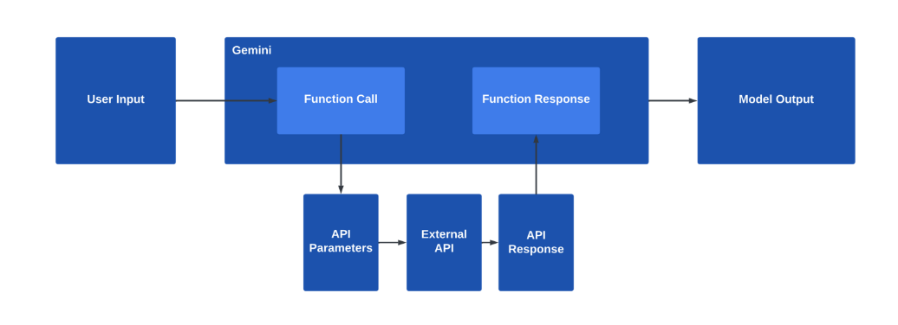

# 函式呼叫

使用 Gemini API 函數呼叫功能，您可以為模型提供自訂函數定義。模型不會直接呼叫這些函數，而是產生指定函數名稱和建議參數的結構化輸出。然後您可以使用函數名稱和參數來呼叫外部 API，然後，您可以使用函數名稱和參數來呼叫外部 API，並將產生的 API 輸出合併到對模型的進一步查詢中，從而使模型提供更全面的回應並採取其他操作。函數呼叫使用戶能夠與資料庫、客戶關係管理系統和文件儲存庫等即時資訊和服務進行互動。該功能還增強了模型提供相關和上下文答案的能力。函數呼叫最適合與外部系統互動。如果您的用例需要模型執行計算但不涉及外部系統或 API，則應該考慮使用程式碼執行。

## 如何呼叫function

## function calling的講解

函式呼叫使您更容易從生成模型中獲取結構化資料輸出。然後，您可以使用這些輸出來呼叫其他 API 並將相關回應資料傳回給模型。換句話說，函數呼叫可以幫助您將產生模型連接到外部系統，以便產生的內容包含最新、最準確的資訊。

您可以為 Gemini 模型提供功能描述。這些是您使用應用語言編寫的函數（也就是說，它們不是 Google Cloud Functions）。模型可能會要求您呼叫函數並傳回結果以幫助模型處理您的查詢。

### 光線控制的API
想像你有一個基本控制光線的應用程式(api)和您允許使用者使用輸入的文字控制光線的明亮度和溫度.可以使用函數呼叫功能了解使用者改變亮度的要求和轉換它們進入到api.

| Parameter | Type | Required | Description |
|:--|:--|:--|:--|
| brightness | number | yes | Light level from 0 to 100. Zero is off and 100 is full brightness. |
| colorTemperature | string | yes | Color temperature of the light fixture which can be daylight, cool or warm. |

```python
{
  "brightness": "50",
  "colorTemperature": "daylight"
}
```

### 定義一個自訂的函式
建立一個符合API需求的函式,這個function一定是被定義在我們應用程式內,function內的程式可以呼叫外部的API.模型不會直接呼叫我們的函式,所以只是註冊一個function.這個function要有很明確的描素

**英文**
- 自訂function的參數和傳出值要描素清楚
- 建立模型時的tools引數值
- enable_automatic_function_calling=True,此設定會由model決定是否執行function

```python
import os
import google.generativeai as genai

def set_light_value(brightness:int, color_temp:str):
    """Set the brightness and color temperature of a room light. (mock API).

    Args:
        brightness: Light level from 0 to 100. Zero is off and 100 is full brightness
        color_temp: Color temperature of the light fixture, which can be `daylight`, `cool` or `warm`.

    Returns:
        A dictionary containing the set brightness and color temperature.
    """
    return {
        "brightness":brightness,
        "colorTemperature":color_temp
    }

model = genai.GenerativeModel(
    model_name='gemini-2.0-flash-exp',
    tools=[set_light_value]
    )
chat = model.start_chat(enable_automatic_function_calling=True)
response = chat.send_message('Dim the lights so the room feels cozy and warm.')
response.text
```

**中文版**

```python
import os
import google.generativeai as genai

def set_light_value(brightness:int, color_temp:str)->str:
    """設定房間的光線亮度和光線溫度 (模擬的API).

    Parameters:
        brightness: 亮度的等級從0~100,如果為0代表關閉光線,如果為100代表光線全開
        color_temp: 代表光線的溫度,有3個等線 `正常光線`, `冷光線` or `溫暖光線`.

    Returns:
        一個詞典物件設定光線高度和光線溫度.
    """
    print(brightness)
    print(color_temp)
    return {
        "brightness":brightness,
        "colorTemperature":color_temp
    }

model = genai.GenerativeModel(
    model_name='gemini-2.0-flash-exp',
    tools=[set_light_value]
    )
chat = model.start_chat(enable_automatic_function_calling=True)
response = chat.send_message('開啟光線至50和設定為正常')
response.text
```

### 多個function的呼叫

```
import os
import google.generativeai as genai

def add(a:float, b:float)->float:
    '''
    傳出a + b.
    '''
    return a + b

def subtract(a:float, b:float)->float:
    '''
    傳出a - b.
    '''
    return a - b

def multiply(a:float, b:float) -> float:
    '''
    傳出a * b.
    '''

    return a * b

def divide(a:float, b:float):
    '''
    傳出 a / b.
    '''

    return a / b

model = genai.GenerativeModel(
    model_name = 'gemini-2.0-flash-exp',
    tools = [add, multiply, divide, subtract]
)

#檢查model的tools
model

#===output====

genai.GenerativeModel(
    model_name='models/gemini-2.0-flash-exp',
    generation_config={},
    safety_settings={},
    tools=<google.generativeai.types.content_types.FunctionLibrary object at 0x7f76154e90>,
    system_instruction=None,
    cached_content=None
)

```

```python
import os
import google.generativeai as genai

def add(a:float, b:float)->float:
    '''
    傳出a + b.
    '''
    return a + b

def subtract(a:float, b:float)->float:
    '''
    傳出a - b.
    '''
    return a - b

def multiply(a:float, b:float) -> float:
    '''
    傳出a * b.
    '''

    return a * b

def divide(a:float, b:float):
    '''
    傳出 a / b.
    '''

    return a / b

model = genai.GenerativeModel(
    model_name = 'gemini-2.0-flash-exp',
    tools = [add, multiply, divide, subtract]
)

chat = model.start_chat(enable_automatic_function_calling=True)

response = chat.send_message(
    "I have 57 cats, each owns 44 mittens, how many mittens is that in total?"
)
response.text

#===output===
'There are 2508 mittens in total.\n'
```


### 透過 ChatSession.history,記錄每一個聊天階段所保留的值

- ChatSession.history屬性儲存依時間順序的user記錄和model的記錄
- 每一輪的對話儲存於ganai.protos.Content實體內,此實體內的資訊有:
	- Role:代表是user或者是model
	- Parts:genai.protos.Part
		- Text:代表純文字訊息
		- Function Call(genai.protos.FunctionCall):一個model的請求,有包含要執行的function和參數
		- Function Response(genai.protos.FunctionResponse):執行funciton完成後,使用者傳出的結果
	

```python
import os
import google.generativeai as genai

def add(a:float, b:float)->float:
    '''
    傳出a + b.
    '''
    return a + b

def subtract(a:float, b:float)->float:
    '''
    傳出a - b.
    '''
    return a - b

def multiply(a:float, b:float) -> float:
    '''
    傳出a * b.
    '''

    return a * b

def divide(a:float, b:float):
    '''
    傳出 a / b.
    '''

    return a / b

model = genai.GenerativeModel(
    model_name = 'gemini-2.0-flash-exp',
    tools = [add, multiply, divide, subtract]
)

chat = model.start_chat(enable_automatic_function_calling=True)

response = chat.send_message(
    "I have 57 cats, each owns 44 mittens, how many mittens is that in total?"
)
response.text

for content in chat.history:
    print(content.role, '->', [type(part).to_dict(part) for part in content.parts])
    print("-" * 80)
    
#===output====
user -> [{'text': 'I have 57 cats, each owns 44 mittens, how many mittens is that in total?'}]
--------------------------------------------------------------------------------
model -> [{'function_call': {'name': 'multiply', 'args': {'a': 57.0, 'b': 44.0}}}]
--------------------------------------------------------------------------------
user -> [{'function_response': {'name': 'multiply', 'response': {'result': 2508.0}}}]
--------------------------------------------------------------------------------
model -> [{'text': 'There are 2508 mittens in total.\n'}]
```



### 手動function的呼叫
- enable_automatic_function_calling=False,預設值是false,代表模型不會自動呼叫,可以依靠手動呼叫,意思是寫程式自已呼叫

```python
import os
import google.generativeai as genai

def find_movies(description:str, location:str = "") -> list[str]:
    """find movie titles currently playing in theaters based on any description, genre, title words, etc.

    Args:
        description: Any kind of description including category or genre, title words, attributes, etc.
        location: The city and state, e.g. San Francisco, CA or a zip code e.g. 95616
    """

    return ["Barbie", "Oppenheimer"]

def find_theaters(location: str, movie: str = ""):
    """Find theaters based on location and optionally movie title which are is currently playing in theaters.

    Args:
        location: The city and state, e.g. San Francisco, CA or a zip code e.g. 95616
        movie: Any movie title
    """
    return ["Googleplex 16", "Android Theatre"]

def get_showtimes(location: str, movie: str, theater: str, date: str):
    """
    Find the start times for movies playing in a specific theater.

    Args:
      location: The city and state, e.g. San Francisco, CA or a zip code e.g. 95616
      movie: Any movie title
      thearer: Name of the theater
      date: Date for requested showtime
    """
    return ["10:00", "11:00"]

functions = {
    "find_movies": find_movies,
    "find_theaters": find_theaters,
    "get_showtimes": get_showtimes,
}

model = genai.GenerativeModel(
    model_name = 'gemini-2.0-flash-exp',
    tools = functions.values()
)

response = model.generate_content(
    "Which theaters in Mountain View show the Barbie movie?"
)

## 不可以使用response.text,因為沒有自動呼叫
response.candidates[0].content.parts

#====output======

[function_call {
  name: "find_theaters"
  args {
    fields {
      key: "movie"
      value {
        string_value: "Barbie"
      }
    }
    fields {
      key: "location"
      value {
        string_value: "Mountain View, CA"
      }
    }
  }
}
]
```

**手動完成**

```python
import os
import google.generativeai as genai

def find_movies(description:str, location:str = "") -> list[str]:
    """find movie titles currently playing in theaters based on any description, genre, title words, etc.

    Args:
        description: Any kind of description including category or genre, title words, attributes, etc.
        location: The city and state, e.g. San Francisco, CA or a zip code e.g. 95616
    """

    return ["Barbie", "Oppenheimer"]

def find_theaters(location: str, movie: str = ""):
    """Find theaters based on location and optionally movie title which are is currently playing in theaters.

    Args:
        location: The city and state, e.g. San Francisco, CA or a zip code e.g. 95616
        movie: Any movie title
    """
    return ["Googleplex 16", "Android Theatre"]

def get_showtimes(location: str, movie: str, theater: str, date: str):
    """
    Find the start times for movies playing in a specific theater.

    Args:
      location: The city and state, e.g. San Francisco, CA or a zip code e.g. 95616
      movie: Any movie title
      thearer: Name of the theater
      date: Date for requested showtime
    """
    return ["10:00", "11:00"]

functions = {
    "find_movies": find_movies,
    "find_theaters": find_theaters,
    "get_showtimes": get_showtimes,
}

model = genai.GenerativeModel(
    model_name = 'gemini-2.0-flash-exp',
    tools = functions.values()
)

response = model.generate_content(
    "Which theaters in Mountain View show the Barbie movie?"
)
##不可以使用response.text,因為沒有自動呼叫
part = response.candidates[0].content.parts[0]

def call_function(function_call, functions):
    function_name = function_call.name
    function_args = function_call.args
    return functions[function_name](**function_args)

if part.function_call:
    result = call_function(part.function_call, functions)

print(result)

#===output====
['Googleplex 16', 'Android Theatre']
```

**連結函式呼叫(呼叫完成後再呼叫下一個)**

```python
import os
import google.generativeai as genai

def find_movies(description:str, location:str = "") -> list[str]:
    """find movie titles currently playing in theaters based on any description, genre, title words, etc.

    Args:
        description: Any kind of description including category or genre, title words, attributes, etc.
        location: The city and state, e.g. San Francisco, CA or a zip code e.g. 95616
    """

    return ["Barbie", "Oppenheimer"]

def find_theaters(location: str, movie: str = ""):
    """Find theaters based on location and optionally movie title which are is currently playing in theaters.

    Args:
        location: The city and state, e.g. San Francisco, CA or a zip code e.g. 95616
        movie: Any movie title
    """
    return ["Googleplex 16", "Android Theatre"]

def get_showtimes(location: str, movie: str, theater: str, date: str):
    """
    Find the start times for movies playing in a specific theater.

    Args:
      location: The city and state, e.g. San Francisco, CA or a zip code e.g. 95616
      movie: Any movie title
      thearer: Name of the theater
      date: Date for requested showtime
    """
    return ["10:00", "11:00"]

functions = {
    "find_movies": find_movies,
    "find_theaters": find_theaters,
    "get_showtimes": get_showtimes,
}

genai.configure(api_key=os.environ['GEMINI_API_KEY'])

model = genai.GenerativeModel(
    model_name = 'gemini-2.0-flash-exp',
    tools = functions.values()
)

chat = model.start_chat(enable_automatic_function_calling=True)
response = chat.send_message(
    "Which comedy movies are shown at tonight in Mountain view and at what time?"
)

for content in chat.history:
    print(content.role, "->", [type(part).to_dict(part) for part in content.parts])
    print("-" * 80)


```


### 平行呼叫


