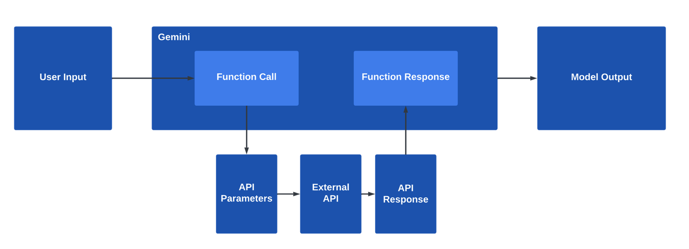

## 國際匯率
### 直接查詢(無法查詢)
- 模型是預訓練,無法取得當下資料

```python
import google.generativeai as genai
import os
from IPython.display import display,Markdown 

genai.configure(api_key=os.environ['GEMINI_API_KEY'])
model = genai.GenerativeModel(
    model_name='gemini-2.0-flash-exp'
)
response = model.generate_content(
   "今日歐元和美金的匯率?" 
)
display(Markdown(response.text))
```

**模型回答**

```markdown
目前歐元兌美元的匯率會不斷波動，建議參考以下幾個方式查詢即時匯率：

**1. 線上匯率查詢網站或App：**

*   **Google 搜尋：** 直接在 Google 搜尋框輸入「歐元 美元 匯率」，Google 會顯示即時匯率及相關圖表。
*   **知名財經網站：** 例如 Yahoo Finance、Bloomberg、路透社等，都有提供即時匯率資訊。
*   **匯率查詢網站：** 例如 XE.com、OANDA 等，提供更詳細的匯率資訊及歷史數據。
*   **銀行或外匯App：** 各家銀行的網站或App通常會提供自家的即時匯率，但可能與其他平台的數據略有差異。

**2. 銀行或外匯服務提供商：**

*   **銀行分行：** 可以直接到銀行分行詢問當日匯率，但可能不是最即時的資訊。
*   **外匯服務提供商：** 像是 Western Union、MoneyGram 等，也會提供匯率資訊。

**提醒：**

*   **匯率是浮動的：** 匯率會隨著市場供需變化而波動，所以查詢到的匯率僅供參考。
*   **買入價與賣出價：** 在進行外幣交易時，銀行或外匯服務提供商會有買入價（你賣給他們）和賣出價（你向他們買入）的差別，要留意實際交易的匯率。
*   **手續費：** 不同管道進行外幣交易可能會收取手續費，也要納入考量。

**建議：**

*   為了獲得最準確的即時匯率，建議參考多個來源交叉比對。
*   如果您有外幣交易的需求，建議多方比較匯率和手續費，選擇最划算的管道。

希望這些資訊對您有幫助！
```

## 使用外部的匯率api
### 使用Model function calling
- 由model自行呼叫
- 由model取得傳回值
- 再由model自行傳出值
- 流程如下圖




```python
#使用外部api
import requests
from pprint import pprint
url = "https://api.frankfurter.app/latest"
response = requests.get(url)
pprint(response.json())

#====output===
{'amount': 1.0,
 'base': 'EUR',
 'date': '2025-01-31',
 'rates': {'AUD': 1.6702,
           'BGN': 1.9558,
           'BRL': 6.0677,
           'CAD': 1.5035,
           'CHF': 0.9449,
           'CNY': 7.5363,
           'CZK': 25.166,
           'DKK': 7.4618,
           'GBP': 0.83608,
           'HKD': 8.099,
           'HUF': 407.95,
           'IDR': 16941,
           'ILS': 3.7199,
           'INR': 89.99,
           'ISK': 146.7,
           'JPY': 160.99,
           'KRW': 1506.62,
           'MXN': 21.477,
           'MYR': 4.6301,
           'NOK': 11.7373,
           'NZD': 1.8391,
           'PHP': 60.682,
           'PLN': 4.213,
           'RON': 4.9767,
           'SEK': 11.474,
           'SGD': 1.4091,
           'THB': 34.915,
           'TRY': 37.266,
           'USD': 1.0393,
           'ZAR': 19.3588}}
```

### 定義function
- function功能說明
- 參數的說明
- 傳出值的說明

```
def get_exchange_rate(currency_from:str,currency_to:str,date:str='latest'):
    '''
    1. 取得目前查詢貨幣的匯率  
    2. 如果沒有指定日期,請設定currency_date=latest

	Args:  
        currency_date:如果沒有指定日期,請設定currency_date=latest,日期,格式必需是YYYY-MM-DD  
        currency_from:要被轉換的貨幣名稱,必需附合`ISO 4217`  
        currency_from:要轉換成為的貨敝名稱,必需附合`ISO 4217`

	Returns:  
        傳出一指定的dictionary,各個key的說明如下  
        date:查詢的日期  
        from_currency:當作基準貨幣名稱  
        to_currency:當作要轉換成為的貨幣名稱  
        rate:匯率
    '''
    if not date:
        date = 'latest' 
    url = f'https://api.frankfurter.app/{date}?base={currency_from}&symbols={currency_to}'
    response = requests.get(url)
    rate = response.json()['rates'][currency_to]
    return{
        "date":date,
        "from_currency":currency_from,
        "to_currency":currency_to,
        "rate":rate
    }
```

### 手動測試function

```python
get_exchange_rate('USD',"AUD")

#===output===
{'date': 'latest', 'from_currency': 'USD', 'to_currency': 'AUD', 'rate': 1.607}
```

### 由model chat來呼叫

```python
import google.generativeai as genai
import os
from IPython.display import display,Markdown 

genai.configure(api_key=os.environ['GEMINI_API_KEY'])
model = genai.GenerativeModel(
    model_name='gemini-2.0-flash-exp',
    tools=[get_exchange_rate],
    system_instruction='''
    如果沒有指定日期,請設定date='latest'
    '''
)

chat = model.start_chat(enable_automatic_function_calling=True)
response = chat.send_message('今日100美金對換澳幣是多少錢?')
print(response.text)
print(chat.last)
```

**輸出**

```
今日 100 美元可兌換 160.7 澳元。
```


