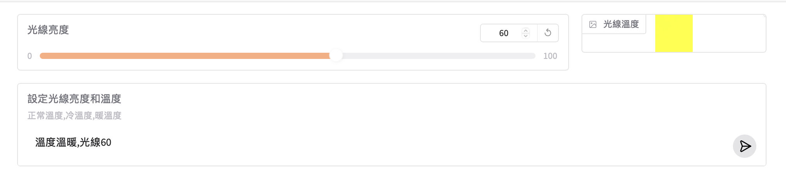

## 調整光線溫度
- gradio介面
- 使用generate_content(),model不會執行自訂function,必需手動取得function名稱和參數

```python
import gradio as gr
import numpy as np
import google.generativeai as genai

def create_color_image(color="#FF0000"):
    #轉換 hex to RGB
    color = color.lstrip("#")
    rgb = tuple(int(color[i:i+2], 16) for i in (0, 2, 4))
    #建立50x50影像
    image = np.zeros((50,50,3), dtype=np.uint8)
    image[:, :] = rgb #填滿顏色
    return image
default_image = create_color_image("#DDDDDD")

def set_light_value(brightness:int, color_temp:str)->str:
    """設定房間的光線亮度和光線溫度 (模擬的API).

    Parameters:
        brightness: 亮度的等級從0~100,如果為0代表關閉光線,如果為100代表光線全開
        color_temp: 代表光線的溫度,有3個等級 `正常溫度`, `冷溫度` or `溫暖溫度`.
    
    """
    print('有執行')
    

model = genai.GenerativeModel(
    model_name='gemini-2.0-flash-exp',
    system_instruction='''
    1. 如果提出的問題不明確,您無法了解,請再次詢問使用者,並請給予幾個提示範例
    2. 如果提供的問題不是呼叫`set_light_value`函式,告訴使用者提供開燈的問題。
    ''',
    tools=[set_light_value]
)

with gr.Blocks() as demo:
    with gr.Row():
        slider_brightness = gr.Slider(0, 100,
                                      value=0,
                                      label="光線亮度",
                                      interactive=False,
                                      scale=3)
        temperature_image = gr.Image(
            value=default_image,
            label="光線溫度",
            interactive=False,
            width=50,
            height=50,
            show_download_button=False,
            show_share_button=False,
            show_fullscreen_button=False,
            scale=1,
            container=True)
    question_text = gr.Textbox(label="設定光線亮度和溫度",
                               info="正常溫度,冷溫度,暖溫度",
                               submit_btn=True,
                               autofocus=True)
    
    @question_text.submit(inputs=[question_text],outputs=[slider_brightness,temperature_image])
    def process(question:str):
        #使用generate_content,model不會去執行function,只會取得參數值,必需手動取得參數值,再自已呼叫
        #也不會有text的回覆
        #這個範例只是為了要取出function的參數值,所以function不需要return
        #使用send_message(),model可以自已去執行function,也會取得參數值
        response = model.generate_content(question,
                                          tool_config={
                                              "function_calling_config":
                                                {
                                                    "mode":"ANY",
                                                    "allowed_function_names": ["set_light_value"]
                                                }
                                              })
        brightness = response.candidates[0].content.parts[0].function_call.args['brightness']
        color_temp = response.candidates[0].content.parts[0].function_call.args['color_temp']
        if color_temp == "正常溫度":
            color = "#DDDDDD"
        elif color_temp == "冷溫度":
            color = "#0000FF"
        else :
            color = "#FFFF00" 
        return brightness,create_color_image(color)
demo.launch()
```

