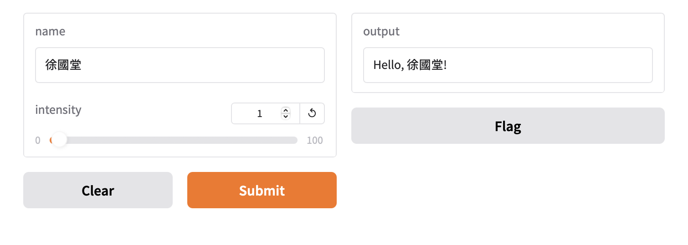

# gradio UI介面
- 適用於機器學習,深度學習,自然語言

### 安裝

```
pip install --upgrade gradio
```

### 建立第一個範例

```python
import gradio as gr

def greet(name, intensity):
    return "Hello, " + name + "!" * int(intensity)

demo = gr.Interface(
    fn=greet,
    inputs=["text", "slider"],
    outputs=["text"],
)

demo.launch()

```

