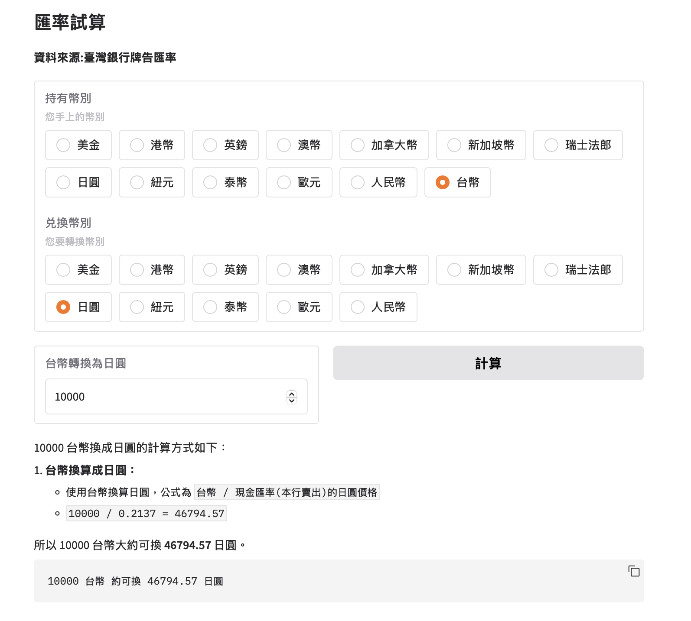

# 產生結構化的資料

Gemini 預設產生非結構化文本，但某些應用程式需要結構化文字。對於這些用例，您可以限制 Gemini 使用 JSON（一種適合自動處理的結構化資料格式）進行回應。您也可以限制模型符合列舉中指定的選項之一進行回應。

- 從報紙文章中提取公司訊息，建立公司資料庫。
- 從簡歷中提取標準化訊息
- 從食譜中提取原料並顯示每種原料的雜貨網站連結。

在您的提示中，您可以要求 Gemini 產生 JSON 格式的輸出，但請注意，該模型並不保證一定會產生 JSON 且只產生 JSON。為了獲得更確定的回應，您可以在回應 Schema 欄位中傳遞特定的 JSON 模式，以便 Gemini 始終以預期的結構進行回應。

本指南向您展示如何透過您選擇的 SDK 使用 generateContent 方法或直接使用 REST API 產生 JSON。這些範例展示了純文字輸入，但 Gemini 還可以對包含圖像、視訊和音訊的多模式請求產生 JSON 回應。


## 產生json格式
當模型配置為輸出 JSON 時，它會以 JSON 格式的輸出回應任何提示。您可以透過提供模式來控制 JSON 回應的結構。有兩種方法可以為模型提供架構：

- 使用文字敘述的提示
- 使用json格式的文字化圖例

這兩種方法都適用於 Gemini 1.5 Flash 和 Gemini 1.5 Pro。

### prompt中提供json文字的描素

- **使用英文範例1**

```
import google.generativeai as genai
import os
import json
genai.configure(api_key=os.environ['GEMINI_API_KEY'])
model = genai.GenerativeModel('gemini-2.0-flash-exp')
prompt = """List a few popular cookie recipes in JSON format.

Use this JSON schema:

Recipe = {'recipe_name':str, 'ingredients':list[str]}
Return: list[Recipe]"""

result = model.generate_content(prompt)
json_str:str = result.text.replace('```json','') #去除最前面的一行
json_str = json_str.replace('```','') #去除最後面的一行
json_structure:list[dict] = json.loads(json_str) #轉換成資料結構
json_structure
```

- **使用中文範例1**

```
import google.generativeai as genai
import os
import json
genai.configure(api_key=os.environ['GEMINI_API_KEY'])
model = genai.GenerativeModel('gemini-2.0-flash-exp')
prompt = """最常見的5種中式料理食譜,請條列式的方法列出食材,並使用json的格式輸出

Use this JSON schema:

Recipe = {'recipe_name':str, 'ingredients':list[str]}
Return: list[Recipe]"""

result = model.generate_content(prompt)
json_str:str = result.text.replace('```json','') #去除最前面的一行
json_str = json_str.replace('```','') #去除最後面的一行
json_structure:list[dict] = json.loads(json_str) #轉換成資料結構
json_structure
```

**範例2**
- 取得台灣銀行牌告匯率
- 取得牌告匯率的表格
- 轉換為csv的字串格式
- 儲存為現在日期.csv檔案

```
#輸出csv字串,並且儲存為檔案
import requests
from bs4 import BeautifulSoup
import google.generativeai as genai
import os
from datetime import datetime
genai.configure(api_key=os.environ['GEMINI_API_KEY'])
# response = requests.get('https://www.merit-times.com.tw/NewsPage.aspx?unid=903451')
response = requests.get('https://rate.bot.com.tw/xrt?Lang=zh-TW')
soup = BeautifulSoup(response.text,"html.parser")
body_content = soup.body
for script_or_style in body_content(['script','style']):
    script_or_style.extract()

table_content = body_content.find(title='牌告匯率')
table_lines = table_content.get_text(separator='\n')
cleaned_content = "\n".join(
    [line.strip() for line in table_lines.splitlines() if line.strip()]
    )


model = genai.GenerativeModel(
    "gemini-2.0-flash-exp",
    system_instruction='''
    1. 你的任務是取出指定的內容,並輸出成csv的格式
    2. 只要輸出csv格式的字串,不要有多餘的文字

    請依照下面的指示:    
    ### 如果找到下面的樣本:
    ```
    澳幣 (AUD)
    澳幣 (AUD)
    20.15
    20.93
    20.365
    20.71
    ```

    ### 輸出的csv格式:
    1. 第1欄:有欄位名稱
    2. 欄位名稱
    - 幣別:str國幣的名稱
    - 幣別代碼:str國家的代碼
    - `現金匯率(本行買入)`:float,無法轉換請用null
    - `現金匯率(本行賣出)`:float,無法轉換請用null
    - `即期匯率(本行買入)`:float,無法轉換請用null
    - `即期匯率(本行賣出)`:float,無法轉換請用null

    ### 輸出的樣本
    ```
    幣別,幣別代碼,現金匯率(本行買入),現金匯率(本行賣出),即期匯率(本行買入),即期匯率(本行賣出)
    澳幣,AUD,20.15,20.93,20.365,20.71
    ```  
    '''
)

response = model.generate_content(cleaned_content)
result_text = response.text

#給程式執行的function
def text_to_csv(csv_text:str):
    '''
    將傳入的csv格式字串,儲存為以現在日期為檔案名稱的csv檔
    '''
    current = datetime.now()
    filename = current.strftime("")
    filename = current.strftime("%Y_%m_%d") + ".csv"
    with open(filename, 'w', encoding='utf-8') as file:
        file.write(csv_text)

text_to_csv(result_text)
```


### 提供json schema給model配置(比較精準)

**英文**

```
import google.generativeai as genai
import typing_extensions as typing
import os
import json

class Recipe(typing.TypedDict):
    recipe_name:str
    ingredients:list[str]

genai.configure(api_key=os.environ['GEMINI_API_KEY'])
model = genai.GenerativeModel('gemini-1.5-flash')
result = model.generate_content(
    'List a few popular cookie recipes.',
    generation_config=genai.GenerationConfig(
        response_mime_type="application/json",
        response_schema=list[Recipe]
    )
)
json_structure = json.loads(result.text)
json_structure
```

**中文**

```python
import google.generativeai as genai
import typing_extensions as typing
import os
import json

class Recipe(typing.TypedDict):
    recipe_name:str
    ingredients:list[str]

genai.configure(api_key=os.environ['GEMINI_API_KEY'])
model = genai.GenerativeModel('gemini-1.5-flash')
result = model.generate_content(
    '最常見的5種中式料理食譜,請條列式的方法列出食材和食材的份量,並使用json的格式輸出,請使用繁體中文',
    generation_config=genai.GenerationConfig(
        response_mime_type="application/json",
        response_schema=list[Recipe]
    )
)
json_structure = json.loads(result.text)
json_structure
```


**將model輸出的json文字轉換為python的資料結構**

```python
import google.generativeai as genai
import os
import json

with open('2025_01_29.csv',encoding='utf-8') as file:
    csv_content = file.read()
    
genai.configure(api_key=os.environ['GEMINI_API_KEY'])
model = genai.GenerativeModel(
    model_name="gemini-2.0-flash-exp",
    system_instruction='''
    ## 請依據以下的csv格式的文字回答問題
    ## 這個表格是銀行的台幣和各幣值的轉換匯率
    ## 如果沒有資料,請輸出`沒有相關幣的資料`
    ## 規則:
        1.如果使用者輸入的是台幣要換取美金,換算公式為:
        `台幣/現金匯率本行賣出的美金價格=`
        2.如果使用者輸入的是美金換取台幣,換算公式為:
        `現金匯率本行買入美金*美金的金額=`
        3.如果不是換成台幣,請先將金額換成台幣後,再轉換為使用者要求的幣值   
    
    ''' + csv_content,
    generation_config={
        "response_mime_type":"application/json",
        "response_schema":list[str]
    }
    
    
)

response = model.generate_content('''                                  
1. 以現有的資料,台幣可以換算的幣值有那一些?
2. 請排除無法計算的幣別
3. 請加入台幣                     
''')
type(json.loads(response.text))

#====output====
list
```

**gradio介面(匯率換算)**

```python
import gradio as gr
import google.generativeai as genai
import os
import json

with open('2025_01_29.csv',encoding='utf-8') as file:
    csv_content = file.read()
    
genai.configure(api_key=os.environ['GEMINI_API_KEY'])
model = genai.GenerativeModel(
    model_name="gemini-2.0-flash-exp",
    system_instruction='''
    ## 請依據以下的csv格式的文字回答問題
    ## 這個表格是銀行的台幣和各幣值的轉換匯率
    ## 如果沒有資料,請輸出`沒有相關幣的資料`
    ## 規則:
        1.如果使用者輸入的是台幣要換取美金,換算公式為:
        `台幣/現金匯率本行賣出的美金價格=`
        2.如果使用者輸入的是美金換取台幣,換算公式為:
        `現金匯率本行買入美金*美金的金額=`
        3.如果不是換成台幣,請先將金額換成台幣後,再轉換為使用者要求的幣值   
    
    ''' + csv_content,
    generation_config={
        "response_mime_type":"application/json",
        "response_schema":list[str]
    }    
)

model1 = genai.GenerativeModel(
    model_name="gemini-2.0-flash-exp",
    system_instruction='''
    ## 請依據以下的csv格式的文字回答問題
    ## 這個表格是銀行的台幣和各幣值的轉換匯率
    ## 如果沒有資料,請輸出`沒有相關幣的資料`
    ## 規則:
        1.如果使用者輸入的是台幣要換取美金,換算公式為:
        `台幣/現金匯率本行賣出的美金價格=`
        2.如果使用者輸入的是美金換取台幣,換算公式為:
        `現金匯率本行買入美金*美金的金額=`
        3.如果不是換成台幣,請先將金額換成台幣後,再轉換為使用者要求的幣值   
    
    ''' + csv_content 
)

response = model.generate_content('''                                  
1. 以現有的資料,台幣可以換算的幣值有那一些?
2. 請排除無法計算的幣別
3. 請加入台幣                     
''')


with gr.Blocks() as demo:
    currencies = json.loads(response.text)
    currency_in = "台幣"
    currency_out = ""
    gr.Markdown('''
        ## 匯率試算 
        **資料來源:臺灣銀行牌告匯率**
    ''')

    in_radio = gr.Radio(currencies,label='持有幣別',info="您手上的幣別",value=currency_in)
    out_radio = gr.Radio(currencies,label='兑換幣別',info="您要轉換幣別")
    
    with gr.Row():        
        number = gr.Number(value=0,label=f'{currency_in}轉換為{currency_out}',visible=True)
        btn = gr.Button(value = '計算',visible=True)

    result_markdown = gr.Markdown()

    def radio_change(in_radio_value, in_output_value):
        """
        使用者一選取,radio,做一些初始動作
        """
        currencies_copy = currencies.copy() 
        currencies_copy.remove(in_radio_value)
        if in_radio_value and in_output_value:
            
            return [
                    gr.Number(visible=True,label=f'{in_radio_value}轉換為{in_output_value}',interactive=True),
                    gr.Button(visible=True),
                    gr.Radio(currencies_copy,label='兑換幣別',info="您要轉換幣別") 
                ]
        else:
            return [
                    gr.Number(visible=False),
                    gr.Button(visible=False),
                    gr.Radio(currencies_copy,label='兑換幣別',info="您要轉換幣別") 
                ]
    
    demo.load(lambda:[gr.Number(visible=False),gr.Button(visible=False)],outputs=[number, btn]) #一開始不顯示
    
    gr.on(
        triggers = [in_radio.change,out_radio.change],
        fn=radio_change,
        inputs = [in_radio,out_radio],
        outputs = [number,btn,out_radio]
    )

    @btn.click(inputs=[number,in_radio,out_radio,],outputs=result_markdown)
    def btn_click(number_value,in_radio_value,in_output_value):
        message = [f"請將{number_value}{in_radio_value}轉換為{in_output_value}","請輸出為markdown格式"]
        response = model1.generate_content(message)
        return response.text
             
demo.launch()
```



### 使用列舉(enum)限定結果輸出

在某些情況下，您可能希望模型從選項清單中選擇選項。為了實現此行為，您可以在配置設定中傳遞一個列舉。您可以在 response_schema 中任何地方使用列舉,列舉實際上是字串清單。

```python
import google.generativeai as genai
import enum
import os


class Choice(enum.Enum):
    PERCUSSION = "Percussion"
    STRING = "String"
    WOODWIND = "Woodwind"
    BRASS = "Brass"
    KEYBOARD = "Keyboard"

genai.configure(api_key=os.environ['GEMINI_API_KEY'])
model = genai.GenerativeModel("gemini-2.0-flash-exp")
organ = genai.upload_file('organ.jpg')
result = model.generate_content(
    ['What kind of instrument is this:',organ],
    generation_config=genai.GenerationConfig(
        response_mime_type="text/x.enum",
        response_schema=Choice
    )
)
print(result.text)

```

### 使用dict代替例舉

```
import google.generativeai as genai
import enum
import os

genai.configure(api_key=os.environ['GEMINI_API_KEY'])
model = genai.GenerativeModel("gemini-2.0-flash-exp")
organ = genai.upload_file('organ.jpg')
result = model.generate_content(
    ['What kind of instrument is this:',organ],
    generation_config=genai.GenerationConfig(
        response_mime_type="text/x.enum",
        response_schema={
            'type': 'STRING',
            'enum':["Percussion", "String", "Woodwind", "Brass", "Keyboard"]
        }
    )
)
print(result.text)

```

### 整合json schema 和 enum的應用

```
import google.generativeai as genai
from typing_extensions import TypedDict
import enum

class Grade(enum.Enum):
    A_PLUS = "a+"
    A = "a"
    B = "b"
    C = "c"
    D = "d"
    F = "f"

class Recipe(TypedDict):
    recipe_name:str
    grade:Grade

model = genai.GenerativeModel("gemini-2.0-flash-exp")
result = model.generate_content(
    "List about 10 cookie recipes, grade them based on popularity",
    generation_config=genai.GenerationConfig(
        response_mime_type="application/json",
        response_schema=list[Recipe]
    )
)
print(result.text)
```


