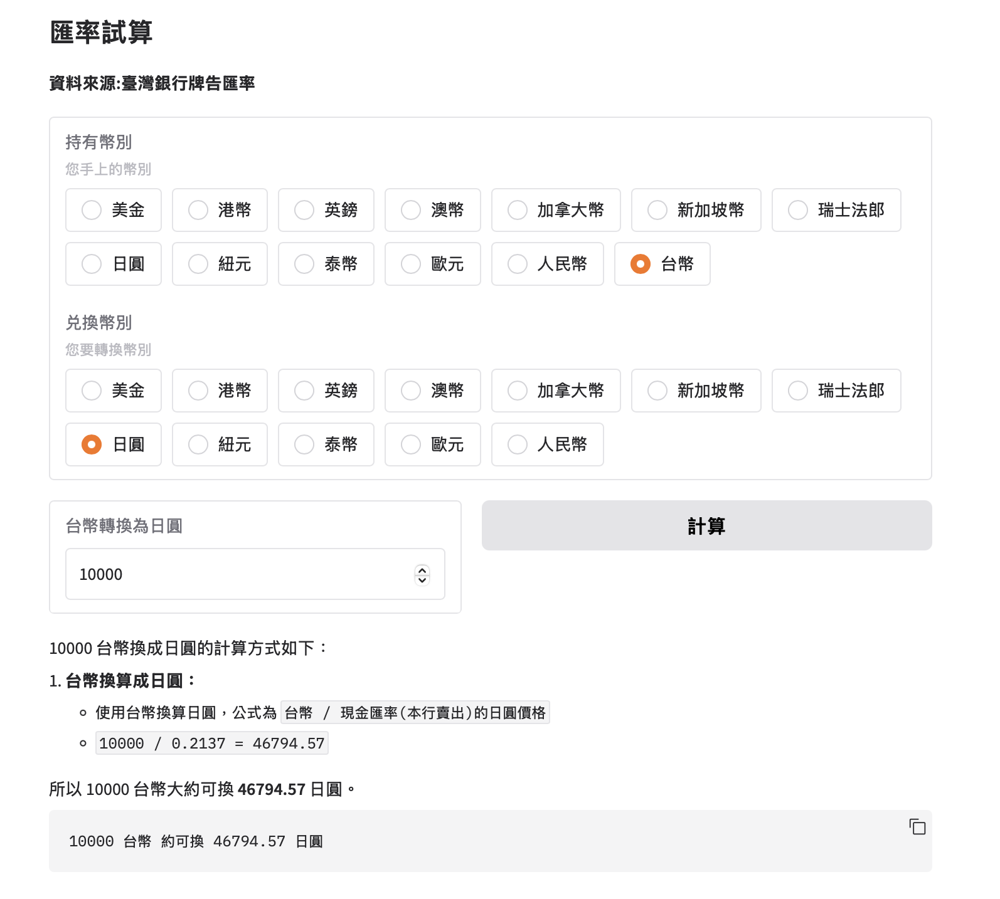

# 產生結構化的資料

Gemini 預設產生非結構化文本，但某些應用程式需要結構化文字。對於這些用例，您可以限制 Gemini 使用 JSON（一種適合自動處理的結構化資料格式）進行回應。您也可以限制模型符合列舉中指定的選項之一進行回應。

- 從報紙文章中提取公司訊息，建立公司資料庫。
- 從簡歷中提取標準化訊息
- 從食譜中提取原料並顯示每種原料的雜貨網站連結。

在您的提示中，您可以要求 Gemini 產生 JSON 格式的輸出，但請注意，該模型並不保證一定會產生 JSON 且只產生 JSON。為了獲得更確定的回應，您可以在回應 Schema 欄位中傳遞特定的 JSON 模式，以便 Gemini 始終以預期的結構進行回應。

本指南向您展示如何透過新版 `google-genai` SDK 使用 `generate_content` 方法產生 JSON。這些範例展示了純文字輸入，但 Gemini 還可以對包含圖像、視訊和音訊的多模式請求產生 JSON 回應。

> **SDK 說明（2026-07）**：本章已全面改用新版 `google-genai`（`from google import genai`、`client.models.generate_content`）。舊版 `google-generativeai`（`genai.configure` / `GenerativeModel`）已淘汰。結構化輸出的設定由 `generation_config=genai.GenerationConfig(...)` 改為 `config=types.GenerateContentConfig(...)`。

---

## 產生json格式
當模型配置為輸出 JSON 時，它會以 JSON 格式的輸出回應任何提示。您可以透過提供模式來控制 JSON 回應的結構。有兩種方法可以為模型提供架構：

- 使用文字敘述的提示
- 使用 `response_schema` 傳入型別化的圖例（比較精準）

這兩種方法都適用於目前的 Gemini 3 世代模型（如 `gemini-flash-latest`）。

### prompt 中提供 json 文字的描述

- **使用英文範例1**

```python
from google import genai
import os
import json

client = genai.Client(api_key=os.environ['GEMINI_API_KEY'])
prompt = """List a few popular cookie recipes in JSON format.

Use this JSON schema:

Recipe = {'recipe_name':str, 'ingredients':list[str]}
Return: list[Recipe]"""

result = client.models.generate_content(
    model="gemini-3.7-flash",
    contents=prompt
)
json_str = result.text.replace('```json', '').replace('```', '')  # 去除 markdown 圍欄
json_structure = json.loads(json_str)  # 轉換成資料結構
json_structure
```

- **使用中文範例1**

```python
from google import genai
import os
import json

client = genai.Client(api_key=os.environ['GEMINI_API_KEY'])
prompt = """最常見的5種中式料理食譜,請條列式的方法列出食材,並使用json的格式輸出

Use this JSON schema:

Recipe = {'recipe_name':str, 'ingredients':list[str]}
Return: list[Recipe]"""

result = client.models.generate_content(
    model="gemini-3.7-flash",
    contents=prompt
)
json_str = result.text.replace('```json', '').replace('```', '')  # 去除 markdown 圍欄
json_structure = json.loads(json_str)  # 轉換成資料結構
json_structure
```

**範例2**
- 取得台灣銀行牌告匯率
- 取得牌告匯率的表格
- 轉換為csv的字串格式
- 儲存為現在日期.csv檔案

```python
#輸出csv字串,並且儲存為檔案
import requests
from bs4 import BeautifulSoup
import os
from datetime import datetime
from google import genai
from google.genai import types

client = genai.Client(api_key=os.environ['GEMINI_API_KEY'])
response = requests.get('https://rate.bot.com.tw/xrt?Lang=zh-TW')
soup = BeautifulSoup(response.text,"html.parser")
body_content = soup.body
for script_or_style in body_content(['script','style']):
    script_or_style.extract()

table_content = body_content.find(title='牌告匯率')
table_lines = table_content.get_text(separator='\n')
cleaned_content = "\n".join(
    [line.strip() for line in table_lines.splitlines() if line.strip()]
    )

system_instruction = '''
1. 你的任務是取出指定的內容,並輸出成csv的格式
2. 只要輸出csv格式的字串,不要有多餘的文字

請依照下面的指示:
### 如果找到下面的樣本:
```
澳幣 (AUD)
澳幣 (AUD)
20.15
20.93
20.365
20.71
```

### 輸出的csv格式:
1. 第1欄:有欄位名稱
2. 欄位名稱
- 幣別:str國幣的名稱
- 幣別代碼:str國家的代碼
- `現金匯率(本行買入)`:float,無法轉換請用null
- `現金匯率(本行賣出)`:float,無法轉換請用null
- `即期匯率(本行買入)`:float,無法轉換請用null
- `即期匯率(本行賣出)`:float,無法轉換請用null

### 輸出的樣本
```
幣別,幣別代碼,現金匯率(本行買入),現金匯率(本行賣出),即期匯率(本行買入),即期匯率(本行賣出)
澳幣,AUD,20.15,20.93,20.365,20.71
```
'''

response = client.models.generate_content(
    model="gemini-3.7-flash",
    contents=cleaned_content,
    config=types.GenerateContentConfig(system_instruction=system_instruction)
)
result_text = response.text

#給程式執行的function
def text_to_csv(csv_text:str):
    '''
    將傳入的csv格式字串,儲存為以現在日期為檔案名稱的csv檔
    '''
    current = datetime.now()
    filename = current.strftime("%Y_%m_%d") + ".csv"
    with open(filename, 'w', encoding='utf-8') as file:
        file.write(csv_text)

text_to_csv(result_text)
```


### 提供 json schema 給 model 配置(比較精準)

新版 SDK 直接支援以 **Pydantic `BaseModel`**、`TypedDict` 或 `list[...]` 當作 `response_schema`；模型會保證輸出符合結構。以下使用 Pydantic（官方目前推薦寫法）。

**英文**

```python
from google import genai
from google.genai import types
from pydantic import BaseModel
import os
import json

class Recipe(BaseModel):
    recipe_name: str
    ingredients: list[str]

client = genai.Client(api_key=os.environ['GEMINI_API_KEY'])
result = client.models.generate_content(
    model="gemini-3.7-flash",
    contents='List a few popular cookie recipes.',
    config=types.GenerateContentConfig(
        response_mime_type="application/json",
        response_schema=list[Recipe]
    )
)
json_structure = json.loads(result.text)
json_structure

# 也可以直接取得解析後的 Python 物件：
recipes: list[Recipe] = result.parsed
```

**中文**

```python
from google import genai
from google.genai import types
from pydantic import BaseModel
import os
import json

class Recipe(BaseModel):
    recipe_name: str
    ingredients: list[str]

client = genai.Client(api_key=os.environ['GEMINI_API_KEY'])
result = client.models.generate_content(
    model="gemini-3.7-flash",
    contents='最常見的5種中式料理食譜,請條列式的方法列出食材和食材的份量,並使用json的格式輸出,請使用繁體中文',
    config=types.GenerateContentConfig(
        response_mime_type="application/json",
        response_schema=list[Recipe]
    )
)
json_structure = json.loads(result.text)
json_structure
```


**將 model 輸出的 json 文字轉換為 python 的資料結構**

```python
import os
import json
from google import genai
from google.genai import types

with open('2025_01_29.csv',encoding='utf-8') as file:
    csv_content = file.read()

client = genai.Client(api_key=os.environ['GEMINI_API_KEY'])
system_instruction = '''
## 請依據以下的csv格式的文字回答問題
## 這個表格是銀行的台幣和各幣值的轉換匯率
## 如果沒有資料,請輸出`沒有相關幣的資料`
## 規則:
    1.如果使用者輸入的是台幣要換取美金,換算公式為:
    `台幣/現金匯率本行賣出的美金價格=`
    2.如果使用者輸入的是美金換取台幣,換算公式為:
    `現金匯率本行買入美金*美金的金額=`
    3.如果不是換成台幣,請先將金額換成台幣後,再轉換為使用者要求的幣值
''' + csv_content

response = client.models.generate_content(
    model="gemini-3.7-flash",
    contents='''
1. 以現有的資料,台幣可以換算的幣值有那一些?
2. 請排除無法計算的幣別
3. 請加入台幣
''',
    config=types.GenerateContentConfig(
        system_instruction=system_instruction,
        response_mime_type="application/json",
        response_schema=list[str]
    )
)
type(json.loads(response.text))

#====output====
list
```

**gradio介面(匯率換算)**

```python
import gradio as gr
import os
import json
from google import genai
from google.genai import types

with open('2025_01_29.csv',encoding='utf-8') as file:
    csv_content = file.read()

client = genai.Client(api_key=os.environ['GEMINI_API_KEY'])

base_instruction = '''
## 請依據以下的csv格式的文字回答問題
## 這個表格是銀行的台幣和各幣值的轉換匯率
## 如果沒有資料,請輸出`沒有相關幣的資料`
## 規則:
    1.如果使用者輸入的是台幣要換取美金,換算公式為:
    `台幣/現金匯率本行賣出的美金價格=`
    2.如果使用者輸入的是美金換取台幣,換算公式為:
    `現金匯率本行買入美金*美金的金額=`
    3.如果不是換成台幣,請先將金額換成台幣後,再轉換為使用者要求的幣值
''' + csv_content

# 取得可換算的幣別清單(JSON)
response = client.models.generate_content(
    model="gemini-3.7-flash",
    contents='''
1. 以現有的資料,台幣可以換算的幣值有那一些?
2. 請排除無法計算的幣別
3. 請加入台幣
''',
    config=types.GenerateContentConfig(
        system_instruction=base_instruction,
        response_mime_type="application/json",
        response_schema=list[str]
    )
)


with gr.Blocks() as demo:
    currencies = json.loads(response.text)
    currency_in = "台幣"
    currency_out = ""
    gr.Markdown('''
        ## 匯率試算
        **資料來源:臺灣銀行牌告匯率**
    ''')

    in_radio = gr.Radio(currencies,label='持有幣別',info="您手上的幣別",value=currency_in)
    out_radio = gr.Radio(currencies,label='兑換幣別',info="您要轉換幣別")

    with gr.Row():
        number = gr.Number(value=0,label=f'{currency_in}轉換為{currency_out}',visible=True)
        btn = gr.Button(value = '計算',visible=True)

    result_markdown = gr.Markdown()

    def radio_change(in_radio_value, in_output_value):
        """
        使用者一選取,radio,做一些初始動作
        """
        currencies_copy = currencies.copy()
        currencies_copy.remove(in_radio_value)
        if in_radio_value and in_output_value:

            return [
                    gr.Number(visible=True,label=f'{in_radio_value}轉換為{in_output_value}',interactive=True),
                    gr.Button(visible=True),
                    gr.Radio(currencies_copy,label='兑換幣別',info="您要轉換幣別")
                ]
        else:
            return [
                    gr.Number(visible=False),
                    gr.Button(visible=False),
                    gr.Radio(currencies_copy,label='兑換幣別',info="您要轉換幣別")
                ]

    demo.load(lambda:[gr.Number(visible=False),gr.Button(visible=False)],outputs=[number, btn]) #一開始不顯示

    gr.on(
        triggers = [in_radio.change,out_radio.change],
        fn=radio_change,
        inputs = [in_radio,out_radio],
        outputs = [number,btn,out_radio]
    )

    @btn.click(inputs=[number,in_radio,out_radio,],outputs=result_markdown)
    def btn_click(number_value,in_radio_value,in_output_value):
        message = [f"請將{number_value}{in_radio_value}轉換為{in_output_value}","請輸出為markdown格式"]
        response = client.models.generate_content(
            model="gemini-3.7-flash",
            contents=message,
            config=types.GenerateContentConfig(system_instruction=base_instruction)
        )
        return response.text

demo.launch()
```



### 使用列舉(enum)限定結果輸出

在某些情況下，您可能希望模型從選項清單中選擇選項。為了實現此行為，您可以在配置設定中傳遞一個列舉。您可以在 `response_schema` 中任何地方使用列舉，列舉實際上是字串清單。

```python
from google import genai
from google.genai import types
import enum
import os

class Choice(enum.Enum):
    PERCUSSION = "Percussion"
    STRING = "String"
    WOODWIND = "Woodwind"
    BRASS = "Brass"
    KEYBOARD = "Keyboard"

client = genai.Client(api_key=os.environ['GEMINI_API_KEY'])
organ = client.files.upload(file='organ.jpg')
result = client.models.generate_content(
    model="gemini-3.7-flash",
    contents=['What kind of instrument is this:', organ],
    config=types.GenerateContentConfig(
        response_mime_type="text/x.enum",
        response_schema=Choice
    )
)
print(result.text)
```

### 使用dict代替列舉

```python
from google import genai
from google.genai import types
import os

client = genai.Client(api_key=os.environ['GEMINI_API_KEY'])
organ = client.files.upload(file='organ.jpg')
result = client.models.generate_content(
    model="gemini-3.7-flash",
    contents=['What kind of instrument is this:', organ],
    config=types.GenerateContentConfig(
        response_mime_type="text/x.enum",
        response_schema={
            'type': 'STRING',
            'enum': ["Percussion", "String", "Woodwind", "Brass", "Keyboard"]
        }
    )
)
print(result.text)
```

### 整合 json schema 和 enum 的應用

```python
from google import genai
from google.genai import types
from pydantic import BaseModel
import enum
import os

class Grade(enum.Enum):
    A_PLUS = "a+"
    A = "a"
    B = "b"
    C = "c"
    D = "d"
    F = "f"

class Recipe(BaseModel):
    recipe_name: str
    grade: Grade

client = genai.Client(api_key=os.environ['GEMINI_API_KEY'])
result = client.models.generate_content(
    model="gemini-3.7-flash",
    contents="List about 10 cookie recipes, grade them based on popularity",
    config=types.GenerateContentConfig(
        response_mime_type="application/json",
        response_schema=list[Recipe]
    )
)
print(result.text)
```
