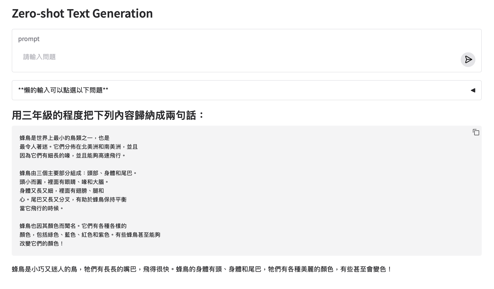

# Gemini文字生成
- 以下提供的Gemini API

當提供文字,圖像,視訊和音訊作為輸入時,Gemini API可以產生文字輸出

## 產生文字的2個方法
- generateContent
- streamGenerateContent

### 最簡單的文字輸出
- 僅使用單獨文字輸入
- 它們稱這個為zero-shot方式


```
import google.generativeai as genai
import os
from IPython.display import display, Markdown, Latex

genai.configure(api_key=os.environ['GEMINI_API_KEY'])

model = genai.GenerativeModel("gemini-2.0-flash-exp")
response = model.generate_content("請問你的姓名(請使用繁體中文回答)?")
display(Markdown(response.text))

#====output=====
我是一個大型語言模型，由 Google 訓練。我沒有名字。
```

**整合gradio介面**

```python
import google.generativeai as genai
import os
import gradio as gr

genai.configure(api_key=os.environ["GEMINI_API_KEY"])
model = genai.GenerativeModel("gemini-2.0-flash-exp")

with gr.Blocks(title="Example") as demo:
    gr.Markdown("# Zero-shot Text Generation")
    
    input_text = gr.Textbox(
        label="prompt",
        placeholder="請輸入問題",
        submit_btn=True
        )
    with gr.Accordion("**懶的輸入可以點選以下問題**",open=False):
        gr.Examples(
            examples=["請問台灣的首都是哪裡？", "請問台灣的國土面積有多大？", "請問台灣的人口有多少？"], 
            label="問題範例",
            inputs=input_text)
    output_text = gr.Markdown()

    @input_text.submit(inputs=input_text, outputs=[input_text,output_text])
    def generate_text(input_str:str):
        response = model.generate_content(input_str)
        return (None, f"## {input_str}\n" + response.text)

demo.launch()
```


**zero-shot方式**
這些提示不包含讓模型複製的範例。Zero-shot 提示基本上顯示模型在沒有任何額外例子或資訊的情況下完成提示的能力。這意味著模型必須依賴已有的知識來產生一個可信的答案。

```
<所有命令內容>
<產生的內容>
```

例如:
<命令內容>

```
用三年級的程度把下列內容歸納成兩句話：

蜂鳥是世界上最小的鳥類之一，也是
最令人著迷。它們分佈在北美洲和南美洲，並且
因為它們有細長的喙，並且能夠高速飛行。

蜂鳥由三個主要部分組成：頭部、身體和尾巴。
頭小而圓，裡面有眼睛、喙和大腦。
身體又長又細，裡面有翅膀、腿和
心。尾巴又長又分叉，有助於蜂鳥保持平衡
當它飛行的時候。

蜂鳥也因其顏色而聞名。它們有各種各樣的
顏色，包括綠色、藍色、紅色和紫色。有些蜂鳥甚至能夠
改變它們的顏色！

```

<產生的內容>

```
蜂鳥是非常活躍的生物。它們大部分時間都在飛行，
而且它們還非常擅長懸停。蜂鳥需要吃很多食物
為了保持精力充沛，它們經常到花叢中吸食花蜜。

蜂鳥是令人驚奇的生物。它們很小，但也非常
強大的。它們非常美麗，而且對生態系統非常重要。
```

**整合gradio介面**
- 和上面的程式碼相同




### 文字和圖片的輸入,產生文字

```
import PIL.Image
import google.generativeai as genai
import os
from IPython.display import display, Markdown, Latex
import PIL

genai.configure(api_key=os.environ['GEMINI_API_KEY'])

model = genai.GenerativeModel("gemini-2.0-flash-exp")
bear = PIL.Image.open('bear.jpg')
response = model.generate_content(['請告訴我這是什麼動物,還有關於它的一些資訊',bear])
display(Markdown(response.text))

#====output=====
好的，這張圖片顯示的是一隻棕熊。

以下是一些關於棕熊的資訊：

基本資訊：

學名： Ursus arctos
體型： 棕熊是陸地上體型最大的食肉動物之一。牠們的體型會根據亞種、棲息地和食物供應而有所不同。一般來說，雄性比雌性大。
體重： 體重範圍很大，從130公斤到700公斤以上都有可能。
體長： 一般體長從1.7米到2.8米不等。
肩高： 約0.9米到1.5米高。
外觀： 牠們有厚厚的皮毛，顏色從淺棕色到深棕色甚至黑色都有。牠們有一個隆起的肩膀肌肉，這給了牠們強大的前肢力量。
壽命： 在野外，棕熊的平均壽命約為20-30年。在人工飼養的環境下，壽命可能更長。
生活習性：

棲息地： 棕熊廣泛分布於北美洲、歐洲和亞洲，牠們偏好森林、山區、草地和沿海地區。
食性： 牠們是雜食性動物，食物包括植物（如漿果、根莖）、昆蟲、魚、小型哺乳動物，有時也會捕食大型動物或食腐肉。
活動： 大部分是獨居動物，除了母熊帶小熊之外。牠們通常在清晨或黃昏時活動。
冬眠： 在冬季，棕熊會進入冬眠狀態，牠們會找一個隱蔽的地方，降低代謝率，以度過寒冷的季節。
溝通： 牠們會透過嗅覺、聲音和肢體語言來溝通。
亞種：

棕熊有很多亞種，其中比較知名的包括：

灰熊 (Grizzly Bear): 北美洲的棕熊，通常體型較大，毛色偏灰。
科迪亞克熊 (Kodiak Bear): 棲息於阿拉斯加科迪亞克群島，是體型最大的棕熊亞種。
歐洲棕熊 (Eurasian Brown Bear): 分布於歐洲和亞洲，體型和毛色多樣。
其他資訊：

保護狀況： 在某些地區，棕熊的數量因棲息地喪失和人類活動而受到威脅。牠們在一些地方被列為保護動物。
與人類的互動： 雖然棕熊通常避免與人類接觸，但如果受到威脅或為了保護幼崽，牠們可能會攻擊人類。在棕熊棲息地，必須採取安全措施，如在野外攜帶防熊噴霧，並且妥善處理食物。
希望這些資訊對您有所幫助！如果您還有其他關於棕熊或其他動物的問題，請隨時提出。
```

### 產生串流文字

```
import google.generativeai as genai
import os
from IPython.display import display, Markdown, Latex

genai.configure(api_key=os.environ['GEMINI_API_KEY'])
model = genai.GenerativeModel("gemini-2.0-flash-exp")
response = model.generate_content("AI是如何工作的(請使用繁體中文回答)?", stream=True)
for chunk in response:
    print(chunk.text)
```

### 建立一個對話

Gemini SDK 可讓您收集多輪問題和答复，從而讓用戶逐步獲得答案或獲得多部分問題的幫助。此 SDK 功能提供了一個介面來追蹤對話歷史記錄，但在背景使用相同的 generateContent 方法來建立回應。

```python
import google.generativeai as genai
import os
from IPython.display import display, Markdown, Latex

genai.configure(api_key=os.environ['GEMINI_API_KEY'])
model = genai.GenerativeModel("gemini-2.0-flash-exp")
chat = model.start_chat(
    history=[
        {'role':'user', "parts":"您好"},
        {'role':'model',"parts":"有什麼是您想知道的?"}
    ]
)

response1 = chat.send_message("我有2隻狗在我的房子內")
display(Markdown(response1.text))

response2 = chat.send_message('在我家裏有多少爪子?')
display(Markdown(response2.text))
```


### 調整回應文字

您發送給模型的每個提示都包含控制模型如何產生回應的參數。您可以使用 GenerationConfig 來設定這些參數。如果不配置參數，模型將使用預設選項，這可能會因模型而異。

```
import google.generativeai as genai
import os
from IPython.display import display, Markdown, Latex

genai.configure(api_key=os.environ['GEMINI_API_KEY'])
model = genai.GenerativeModel('gemini-2.0-flash-exp')
response = model.generate_content(
    "說明AI如何工作",
    generation_config=genai.GenerationConfig(
        temperature=0, # 確定性輸出（無隨機性）
        top_p=0.95, # 機率採樣閾值
        top_k=20,  #考慮的最高機率詞彙數
        candidate_count=1,  # 生成一個回答
        max_output_tokens=100, # 最大輸出長度
        stop_sequences=["STOP!"], # 停止序列
        presence_penalty=0.0, # 控制重複內容的懲罰
        frequency_penalty=0.0, # 控制詞頻的懲罰
    )
)

display(Markdown(response.text))
```

## 相關的參數
> 來自iBonnie_愛邦尼發佈於iBonnie_愛邦尼 https://vocus.cc/article/665ee3e9fd89780001ad34ed


### Temperature
「Temperature 」是文字建立過程中選擇接龍單字時控制"隨機性"的設定。較低的Temperature值使文字更加的可預測和擁有一致性;而較高的Temperature值可以讓自由度和創造力更高，使內容不太一致。

**“Temperature”的範例**

- Temperature = 0：反應非常可預測，始終選擇下一個最可能的字。這對於事實和準確性非常重要的答案非常有用。例如：如果您問“鍛煉有什麼好處？”，Temperature為 0 時，模型可能會說：“鍛煉可以改善心臟健康和肌肉力量，降低患慢性病的機會，並有助於控制體重。”
- Temperature = 1：模型會採取更多隨機性，去選擇原本不太可能出現的接龍單詞，這可能會產生更具創意(不可預測)的答案。例如：如果您問“鍛煉有什麼好處？”，Temperature為 1，您可能會得到：“運動是煉金術士，將汗水轉化為奇蹟療法，是在踏上奇蹟旅途的一場盛宴，你應該將它轉化為永生的魔咒。”

### Top_p

「Top_p」是決定要考慮多少可能單字的設定。高“top_p”值意味著模型會考慮更多可能的單詞，甚至是不太可能的單詞，這使得生成的文本更加多樣化。

- Top_p = 0.5：這意味著僅考慮總機率至少為 50% 的詞彙，忽略不太可能的單字並保持一定程度不同反應的水準。
例如您詢問一本冒險書的書名，top-p 為 0.5，模型可能會給出：「藍山之謎」。

- Top_p = 0.9：這樣會在選擇中包含了更多的詞彙，允許更多的多樣性和原創性。對於相同的冒險書的書名，模型可能會創建：「來自深淵的聲音：勇敢者的肖像」。

### 混合「Temperature」和「Top_p」
組合“Temperature”和“top_p”可以提供多種文字樣式。

較低的Temperature和較高的 top-p 可以產生具有創意的連貫文本: 由於Temperature低，答案通常邏輯一致，但由於高top-p，他們仍然可以擁有豐富的詞彙和想法。此設定適用於清晰度至關重要的教育或資訊性文本，但您也希望保持讀者的興趣。

另一方面，較高的Temperature和較低的 top-p 可能會將常用單字以不可預測的方式組合在一起: 這種相反的設定通常會導致文本中的句子本身可能有意義，但整體似乎不連貫或不太合乎邏輯。較高的Temperature允許句子結構有更多的變化，而較低的 top-p 將單字選擇限制為最可能的單字。如果您想得到意想不到的結果或透過不尋常的概念組合激發新想法的創意環境中非常有用。

法律文件或技術報告，「Temperature」越低越好。對於創意工作，例如小說寫作或廣告，在這兩種設定中使用更高的值可能是一個好主意。

### top_k
top_k參數用予限制模型在生成下一個詞時考慮的候選詞的範圍,在大語言模型中,每個詞詞都有一個預測概率,top_k參數決定了模型只考慮概最高的k個詞。

top_k較低(1~10):模型只考慮概率最高的幾個詞,這有助於會成更加連貫和相關的本文,但可能會減小文本的多樣性和劊告性

top_k較高(如100或更多):模型考慮更多的候選詞,這可以增加文本的多樣性,因為它允許更多可能的詞被選中,但同時可能會引入一些不相關會不連員的詞

### candidate_count

生成回答的數量


## 增加系統命令

統指令讓您可以根據特定需求和用例來控制模型的行為。

```python
import google.generativeai as genai
import os
from IPython.display import display, Markdown, Latex

genai.configure(api_key=os.environ['GEMINI_API_KEY'])
model = genai.GenerativeModel(
    'gemini-2.0-flash-exp',
     system_instruction = "你是一隻貓,你的名字叫Neko."
    )

response = model.generate_content('早安,您好嗎')
display(Markdown(response.text))

```


## 範例
- [旅遊計畫](./tripPlanner.ipynb)


