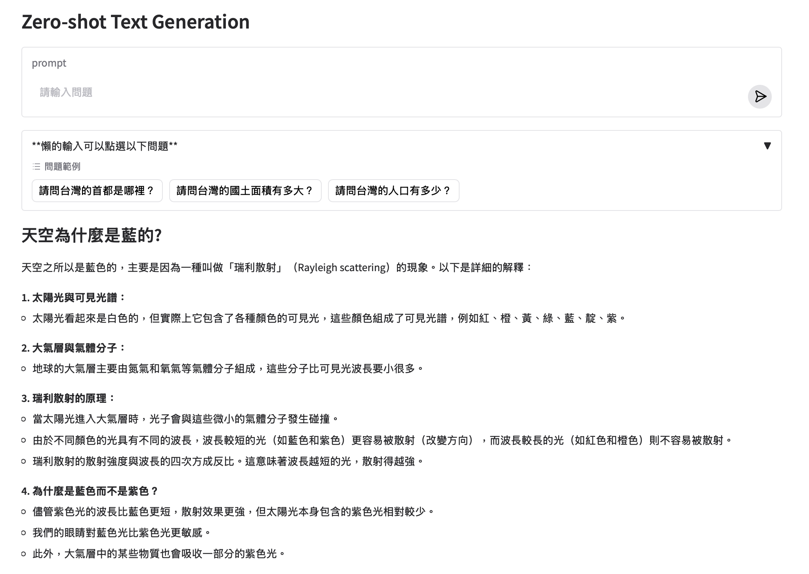
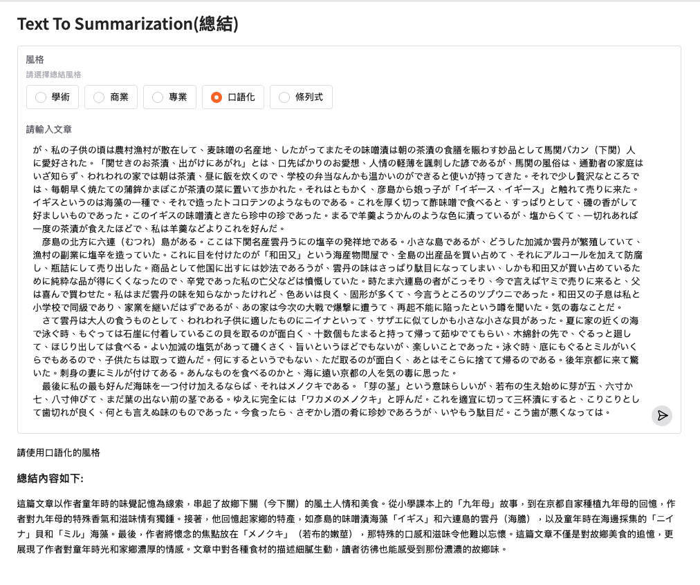
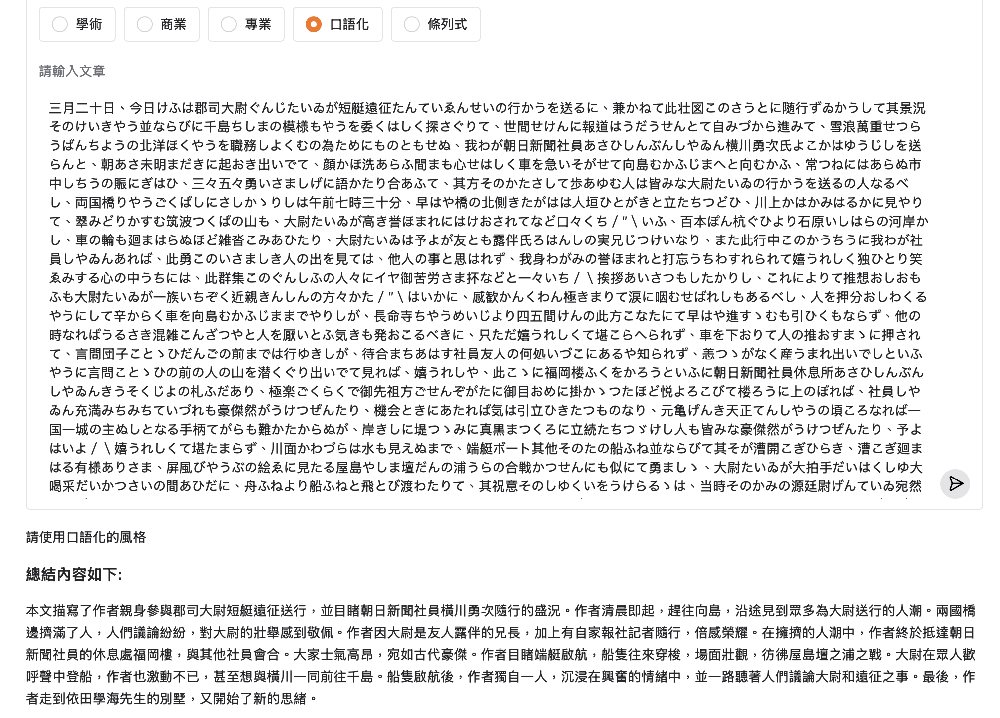
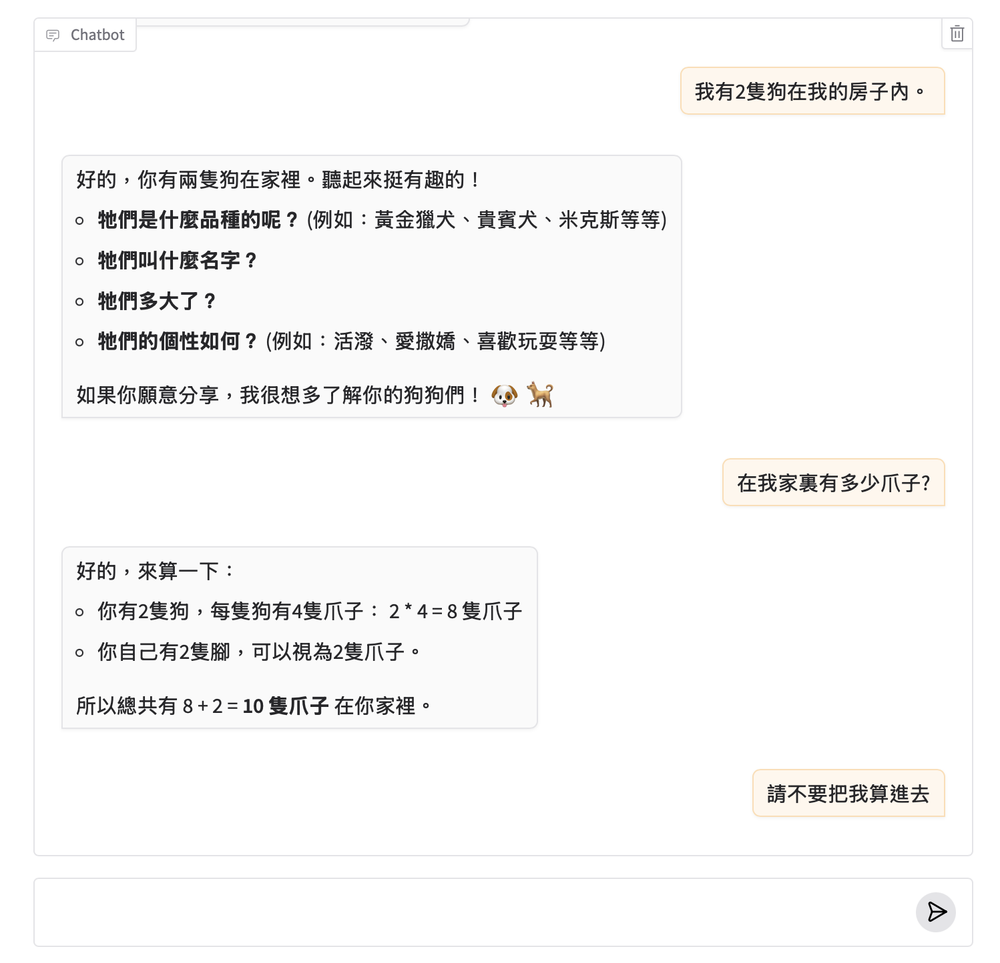

# Gemini文字生成
- 以下提供的Gemini API

當提供文字,圖像,視訊和音訊作為輸入時,Gemini API可以產生文字輸出

## 產生文字的2個方法
- generateContent
- streamGenerateContent

### 最簡單的文字輸出
- 僅使用單獨文字輸入
- 它們稱這個為zero-shot方式


```
from google import genai
from IPython.display import display, Markdown

client = genai.Client()

response = client.models.generate_content(
    model="gemini-2.5-flash",
    contents="請問你的姓名(請使用繁體中文回答)?"
)

display(Markdown(response.text))

#====output=====
您好，我沒有名字。我是一個大型語言模型，由 Google 訓練。
```

**zero-shot整合gradio介面**

```python
import google.generativeai as genai
import os
import gradio as gr

genai.configure(api_key=os.environ["GEMINI_API_KEY"])
model = genai.GenerativeModel("gemini-2.0-flash-exp")

with gr.Blocks(title="Example") as demo:
    gr.Markdown("# Zero-shot Text Generation")
    
    input_text = gr.Textbox(
        label="prompt",
        placeholder="請輸入問題",
        submit_btn=True
        )
    with gr.Accordion("**懶的輸入可以點選以下問題**",open=False):
        gr.Examples(
            examples=["請問台灣的首都是哪裡？", "請問台灣的國土面積有多大？", "請問台灣的人口有多少？"], 
            label="問題範例",
            inputs=input_text)
    output_text = gr.Markdown()

    @input_text.submit(inputs=input_text, outputs=[input_text,output_text])
    def generate_text(input_str:str):
        response = model.generate_content(input_str)
        return (None, f"## {input_str}\n" + response.text)

demo.launch()
```



**zero-shot generation方式**
- 可以使用上面範例完成
這些提示不包含讓模型複製的範例。Zero-shot 提示基本上顯示模型在沒有任何額外例子或資訊的情況下完成提示的能力。這意味著模型必須依賴已有的知識來產生一個可信的答案。

```
<所有命令內容>
<產生的內容>
```

例如:
<命令內容>

```
用三年級的程度把下列內容歸納成兩句話：

蜂鳥是世界上最小的鳥類之一，也是
最令人著迷。它們分佈在北美洲和南美洲，並且
因為它們有細長的喙，並且能夠高速飛行。

蜂鳥由三個主要部分組成：頭部、身體和尾巴。
頭小而圓，裡面有眼睛、喙和大腦。
身體又長又細，裡面有翅膀、腿和
心。尾巴又長又分叉，有助於蜂鳥保持平衡
當它飛行的時候。

蜂鳥也因其顏色而聞名。它們有各種各樣的
顏色，包括綠色、藍色、紅色和紫色。有些蜂鳥甚至能夠
改變它們的顏色！

```

<產生的內容>

```
蜂鳥是非常活躍的生物。它們大部分時間都在飛行，
而且它們還非常擅長懸停。蜂鳥需要吃很多食物
為了保持精力充沛，它們經常到花叢中吸食花蜜。

蜂鳥是令人驚奇的生物。它們很小，但也非常
強大的。它們非常美麗，而且對生態系統非常重要。
```

**text-to-summarization and translate 整合gradio介面**
**有包含system instruction**
- [日本公開文章](https://www.aozora.gr.jp/index_pages/person_a.html)
- [中文公開短篇小說](https://ibook.idv.tw/enews/enews/enews25.html)




### 多模態輸入內容

文字和圖片的輸入,產生文字

```
import PIL.Image
from google import genai
from IPython.display import display, Markdown

client = genai.Client()
image = PIL.Image.open('bear.jpg')
response = client.models.generate_content(
    model="gemini-2.5-flash",
    contents=[image, "請告訴我這是什麼動物,還有關於它的一些資訊"]
)

display(Markdown(response.text))
```

====output=====

根據您提供的圖片，這是一隻 **棕熊 (Brown Bear)**，也常被稱為 **灰熊 (Grizzly Bear)**。

以下是關於棕熊的一些資訊：

1.  **名稱與分類：**
    *   **學名：** *Ursus arctos*
    *   **中文名：** 棕熊。在北美洲內陸地區的亞種常被稱為「灰熊」(Grizzly Bear)，因為牠們的毛尖常呈銀灰色，看起來像「灰」色的。在阿拉斯加沿海地區，還有體型更大的亞種，如科迪亞克棕熊。

2.  **外觀特徵：**
    *   **體型：** 棕熊是陸地上最大的食肉動物之一，體型龐大而強壯。成年雄性比雌性更大。
    *   **毛色：** 毛色多變，從淺金色、黃棕色、紅棕色到深棕色，甚至接近黑色。
    *   **肩部隆起：** 最顯著的特徵是牠們肩部有一塊非常明顯的肌肉隆起（駝峰），這塊肌肉賦予牠們強大的前肢力量，特別適合挖掘。這也是區分棕熊和黑熊的一個重要標誌（黑熊通常沒有明顯的肩部隆起）。
    *   **爪子：** 擁有長而彎曲、不可完全收回的爪子，非常適合挖掘根莖、捕捉魚類或撕裂食物。
    *   **面部：** 通常臉部較寬，額頭相對扁平，耳朵較小而圓。

3.  **分佈與棲息地：**
    *   棕熊是分佈最廣泛的熊科動物，廣泛分佈於北半球，包括北美洲（阿拉斯加、加拿大、美國西北部）、歐洲（部分地區）和亞洲（俄羅斯、中國、日本等）。
    *   牠們的棲息地多樣，從森林、山區、苔原到沿海地區都有牠們的身影。

4.  **食性：**
    *   棕熊是**雜食性**動物，食性非常廣泛且有很強的適應性。
    *   **植物：** 主要食物來源是植物，包括漿果、草、根莖、堅果、蘑菇等。
    *   **動物：** 也會捕食昆蟲（如螞蟻、幼蟲）、魚類（尤其是在鮭魚洄游的季節，會大量捕食）、小型哺乳動物（如嚙齒動物）、腐肉，偶爾也會捕食大型有蹄類動物的幼崽（如鹿、麋鹿幼崽）。

5.  **行為與習性：**
    *   **獨居：** 除了母熊與幼崽外，棕熊大多是獨居動物。
    *   **冬眠：** 在食物稀缺的寒冷冬季，棕熊會進入冬眠狀態，在洞穴或巢穴中度過。
    *   **感官：** 嗅覺極其靈敏，是牠們尋找食物和感知周圍環境的主要方式。聽覺和視覺也較為敏銳。
    *   **速度：** 儘管體型龐大，但棕熊奔跑速度非常快，短距離爆發力可達每小時56公里。
    *   **性格：** 通常會盡量避開人類，但若受到驚嚇、保衛幼崽或食物時，會變得具有攻擊性，因此在野外遇到棕熊需要保持警惕並遵循安全指南。

6.  **保護狀況：**
    *   全球範圍內，棕熊的大部分種群被國際自然保護聯盟（IUCN）列為「無危物種」。
    *   然而，某些區域性亞種或孤立種群仍然面臨棲息地喪失、人熊衝突和偷獵等威脅，例如在美國本土的灰熊，仍被列為受威脅物種。

這隻棕熊看起來非常健康和警惕，可能是正在尋找食物或觀察周圍的環境。

---

**使用gradio介面**

```
import gradio as gr
import PIL
import google.generativeai as genai
import os

genai.configure(api_key=os.environ['GEMINI_API_KEY'])
model = genai.GenerativeModel("gemini-2.0-flash-exp")


with gr.Blocks() as demo:
    gr.Markdown('''
        1. 請先上傳圖片
        2. 再詢問ai對於圖片的問題
    ''')
    with gr.Row():
        image = gr.Image(type='pil')
        text_box = gr.Textbox(placeholder="請輸入對圖片的說明:",submit_btn=True)
    answer = gr.Markdown(min_height=100,container=True)

    @text_box.submit(inputs=[image, text_box],outputs=[answer,answer])
    def image_to_text(image, text_box,progress=gr.Progress()):
        if not image:
            gr.Warning("沒有圖片")
            return None            
            
        if text_box=="":
            gr.Warning("請輸入文字")
            return None
        progress(0.5, desc="請稍後")
        response = model.generate_content([text_box, image])
        progress(1, desc="完成")
        return gr.Markdown(container=True),response.text
    @image.upload(outputs=[answer,answer])
    def clear_answer():
        return gr.Markdown(container=False),""
demo.launch()
```


---

### 產生串流文字

```python
from google import genai

client = genai.Client()
response = client.models.generate_content_stream(
    model="gemini-2.5-flash",
    contents=["AI是如何工作的(請使用繁體中文回答)?"]
)
for chunk in response:
    print(chunk.text)
```

**output**
```
人工智慧 (AI) 的核心目標是讓機器能夠模仿、甚至超越人類的認知能力，例如學習、推理、問題解決、感知和理解語言等。它並不是一個單一的「大腦」，而是一系列演算法
和技術的集合。

以下是 AI 工作的基本原理和步驟：

### AI 的基本工作原理

AI 的運作方式可以概括為：**「從大量數據中學習模式和規律，然後利用這些學到的
知識來對新數據進行預測、分類、生成或決策。」**

想像一個小孩學習辨識「貓」。父母給他看成千上萬張貓的照片（數據），每次他指錯了，父母
會糾正他（計算誤差），然後他會調整對「貓」的認知（調整參數），直到他能準確地辨識出所有新的貓咪（推論）。AI 的工作方式與此類似。


### AI 工作的關鍵步驟

#### 1. 數據收集與準備 (Data Collection & Preparation)

*   **數據是燃料：** AI 的學習始於「數據」。就像人類需要經驗一樣，AI 需要大量的數據
來學習模式和規律。這些數據可以是文字、圖片、聲音、數字、感測器讀數等。
*   **數據標註：** 對於許多AI任務（特別是「監督式學習」），這些
數據還需要被「標註」（labelled）。例如，在圖像識別任務中，你需要告訴AI這張圖片裡有「貓」，那張圖片裡有「狗」。數據的品質和數量直接影響 AI 的學習效果
。
*   **數據清洗：** 移除錯誤、重複或不完整的數據，確保數據的準確性和一致性。

#### 2. 模型訓練 (Model Training)

這是 AI 學習的核心階段。

*   **
選擇模型與演算法：** 根據任務類型（例如：分類、預測、生成、聚類等），選擇合適的演算法和模型架構。常見的有：
    *   **機器學習 (Machine Learning,
 ML)：** 這是 AI 的核心分支，讓機器能夠從數據中學習而不需要被明確地編程。
        *   **監督式學習 (Supervised Learning)：** 給定帶有標籤的輸入數據和
對應的輸出數據，模型從中學習映射關係。例如，給予圖片和「是貓/不是貓」的標籤，模型學習辨識貓。
        *   **非監督式學習 (Unsupervised Learning)：
** 給定沒有標籤的數據，模型自行找出數據中的隱藏結構或模式。例如，將顧客分組。
        *   **強化學習 (Reinforcement Learning)：** 模型透過與環境互動，根據行動
的「獎勵」或「懲罰」來學習最佳策略。例如，讓 AI 玩遊戲。
    *   **深度學習 (Deep Learning, DL)：** 機器學習的一個子集，使用多層次的
**神經網路**（模仿人腦結構）來處理數據。它在圖像識別、語音識別和自然語言處理等複雜任務中表現出色。

*   **學習過程：**
    1.  **輸入
數據：** 模型會「吃進」大量的訓練數據。
    2.  **做出預測：** 它會根據其當前的「理解」（即內部的參數設定）對這些數據做出預測或判斷
。
    3.  **計算誤差（損失函數）：** 模型的預測結果會與真實的標註數據進行比較，計算出兩者之間的「誤差」或「損失」（Loss）。這個誤差值代表了模型表現
的好壞。
    4.  **調整參數（最佳化）：** 這是關鍵步驟。AI 模型會使用最佳化技術（如**梯度下降法**）來微調其內部的「參數」（Weights 和 Bi
ases）。目標是**減少下一次預測時的誤差**。這個過程會反覆進行數百萬次，直到模型的性能（例如準確度）達到可接受的水平。

#### 3. 模型評估與
調整 (Model Evaluation & Refinement)

*   **評估性能：** 在訓練完成後，會使用一部分獨立的「測試數據」來評估模型的性能。這些數據是模型從未見過的，用來檢
驗模型是否真正學會了泛化（Generalization），而不僅僅是記住了訓練數據。
*   **超參數調整：** 根據評估結果，可能需要調整模型的「超參數」（Hyperparameters，
例如學習率、網路層數、神經元數量等），然後重新訓練，直到達到滿意的效果。

#### 4. 推論與應用 (Inference & Application)

*   **實戰應用：** 一
旦模型完成訓練並通過評估，它就被認為是「學成了」。這時，當遇到從未見過的新數據時，模型會利用它在訓練階段學習到的知識和模式，對新數據進行「推
論」（Inference），並做出預測、分類或生成相應的結果。
*   **範例：**
    *   一個訓練好的圖像識別模型可以識別新照片中的物體。
    *   
一個語言模型可以理解你的語音指令並生成文字。
    *   一個推薦系統可以根據你的觀看歷史推薦新的電影。

### 總結

AI 的工作方式可以視為一個不斷迭代和最佳化的
過程。它從數據中學習，透過試錯（誤差計算和參數調整）來改進自己，最終能夠像人類一樣，甚至比人類更快、更精準地完成特定任務。這個過程的效率和準確性
，很大程度上取決於數據的品質、演算法的選擇和計算資源的投入。
```

---

**streaming_gradio_介面**

```python
import google.generativeai as genai
import os
import gradio as gr

genai.configure(api_key=os.environ["GEMINI_API_KEY"])
model = genai.GenerativeModel(
    "gemini-2.0-flash-exp",
    system_instruction = """
    你是一位文章的總結專家,也是一位繁體中文的高手。
    你的任務是:
    1. 請將內容`總結`
    """
)

with gr.Blocks(title="Example") as demo:
    gr.Markdown("# Text To Summarization(總結)")
    style_radio = gr.Radio(['學術','商業','專業','口語化','條列式'],label='風格',info="請選擇總結風格",value='口語化') 
    input_text = gr.Textbox(
        label="請輸入文章",
        lines=10,
        submit_btn=True
        )
    output_md = gr.Markdown()

    @input_text.submit(inputs=[style_radio,input_text], outputs=[output_md])
    def generate_text(style:str,input_str:str):
        response = model.generate_content(input_str,stream=True)
        if style=="口語化":
            style = "請使用口語化的風格\n"
        elif style == "學術":
            style = "請使用專業學術的風格\n"
        elif style == "商業":
            style = "請使用商業文章的風格\n"
        elif style == "條列式":
            style = "請條列式重點\n"

        result_text = ""
        
        for chunk in response:
            result_text += chunk.text
            yield( f"{style}\n\n### 總結內容如下:\n" + result_text)

        

demo.launch()
```



---

### 多輪對話(chat)(即時通訊)

我們的 SDK 提供相關功能，可將多輪提示和回覆收集到對話中，方便您追蹤對話記錄。 

注意： 即時通訊功能只會透過 SDK 實作。但幕後仍使用 generateContent API。如果是多輪對話，每次後續對話時，系統都會將完整對話記錄傳送給模型。

```python
from google import genai
from IPython.display import display, Markdown

client = genai.Client()
chat = client.chats.create(model="gemini-2.5-flash")


response = chat.send_message("我有2隻狗在我的房子內")
display(Markdown(response.text))

response = chat.send_message('在我家裏有多少爪子?')
display(Markdown(response.text))

print("===================")
for message in chat.get_history():
    print(f'role - {message.role}',end=": ")
    print(message.parts[0].text)
    
```

---

### 串流功能也可用於多輪對話。

```python
from google import genai

client = genai.Client()
chat = client.chats.create(model="gemini-2.5-flash")

response = chat.send_message_stream("我有2隻狗在我的房子內")
for chunk in response:
    print(chunk.text, end="")

response = chat.send_message_stream('在我家裏有多少爪子?')
for chunk in response:
    print(chunk.text, end="")

for message in chat.get_history():
    print(f'role - {message.role}', end=": ")
    print(message.parts[0].text)
```


---


**chat_gradio簡單範例**

```python
import google.generativeai as genai
import os
import gradio as gr

genai.configure(api_key=os.environ['GEMINI_API_KEY'])
model = genai.GenerativeModel("gemini-2.0-flash-exp")
chat = model.start_chat()

def processing_chat(message, history):
    response = chat.send_message(message)
    return response.text

demo = gr.ChatInterface(
    fn = processing_chat,
    type="messages"
)

demo.launch()
```




### 系統指示和其他設定

你可以使用系統指令引導 Gemini 模型行為。如要這麼做，請傳遞 GenerateContentConfig 物件。

```python
from google import genai
from google.genai import types

client = genai.Client()

response = client.models.generate_content(
    model="gemini-2.5-flash",
    config=types.GenerateContentConfig(
        system_instruction="你是一隻貓,你的名字叫Neko."),
    contents="早安,您好嗎?"
)

print(response.text)
```

---

GenerateContentConfig 物件也可用來覆寫預設生成參數，例如溫度。

```
from google import genai
from google.genai import types
from IPython.display import display, Markdown, Latex

client = genai.Client()

response = client.models.generate_content(
    model = "gemini-2.5-flash",
    contents = ["說明AI如何工作"],
    config=types.GenerateContentConfig(
        temperature=0, # 確定性輸出（無隨機性）
        topP=0.95, # 機率採樣閾值
        topK=20  #考慮的最高機率詞彙數
    )
)

print(response.text)


```

如需可設定參數的完整清單及其說明，請參閱 API 參考資料中的 [GenerateContentConfig](https://ai.google.dev/api/generate-content?hl=zh-tw#v1beta.GenerationConfig)。

## 相關的參數
> 來自iBonnie_愛邦尼發佈於iBonnie_愛邦尼 https://vocus.cc/article/665ee3e9fd89780001ad34ed


### Temperature
「Temperature 」是文字建立過程中選擇接龍單字時控制"隨機性"的設定。較低的Temperature值使文字更加的可預測和擁有一致性;而較高的Temperature值可以讓自由度和創造力更高，使內容不太一致。

**“Temperature”的範例**

- Temperature = 0：反應非常可預測，始終選擇下一個最可能的字。這對於事實和準確性非常重要的答案非常有用。例如：如果您問“鍛煉有什麼好處？”，Temperature為 0 時，模型可能會說：“鍛煉可以改善心臟健康和肌肉力量，降低患慢性病的機會，並有助於控制體重。”
- Temperature = 1：模型會採取更多隨機性，去選擇原本不太可能出現的接龍單詞，這可能會產生更具創意(不可預測)的答案。例如：如果您問“鍛煉有什麼好處？”，Temperature為 1，您可能會得到：“運動是煉金術士，將汗水轉化為奇蹟療法，是在踏上奇蹟旅途的一場盛宴，你應該將它轉化為永生的魔咒。”

### Top_p

「Top_p」是決定要考慮多少可能單字的設定。高“top_p”值意味著模型會考慮更多可能的單詞，甚至是不太可能的單詞，這使得生成的文本更加多樣化。

- Top_p = 0.5：這意味著僅考慮總機率至少為 50% 的詞彙，忽略不太可能的單字並保持一定程度不同反應的水準。
例如您詢問一本冒險書的書名，top-p 為 0.5，模型可能會給出：「藍山之謎」。

- Top_p = 0.9：這樣會在選擇中包含了更多的詞彙，允許更多的多樣性和原創性。對於相同的冒險書的書名，模型可能會創建：「來自深淵的聲音：勇敢者的肖像」。

### 混合「Temperature」和「Top_p」
組合“Temperature”和“top_p”可以提供多種文字樣式。

較低的Temperature和較高的 top-p 可以產生具有創意的連貫文本: 由於Temperature低，答案通常邏輯一致，但由於高top-p，他們仍然可以擁有豐富的詞彙和想法。此設定適用於清晰度至關重要的教育或資訊性文本，但您也希望保持讀者的興趣。

另一方面，較高的Temperature和較低的 top-p 可能會將常用單字以不可預測的方式組合在一起: 這種相反的設定通常會導致文本中的句子本身可能有意義，但整體似乎不連貫或不太合乎邏輯。較高的Temperature允許句子結構有更多的變化，而較低的 top-p 將單字選擇限制為最可能的單字。如果您想得到意想不到的結果或透過不尋常的概念組合激發新想法的創意環境中非常有用。

法律文件或技術報告，「Temperature」越低越好。對於創意工作，例如小說寫作或廣告，在這兩種設定中使用更高的值可能是一個好主意。

### top_k
top_k參數用予限制模型在生成下一個詞時考慮的候選詞的範圍,在大語言模型中,每個詞詞都有一個預測概率,top_k參數決定了模型只考慮概最高的k個詞。

top_k較低(1~10):模型只考慮概率最高的幾個詞,這有助於會成更加連貫和相關的本文,但可能會減小文本的多樣性和劊告性

top_k較高(如100或更多):模型考慮更多的候選詞,這可以增加文本的多樣性,因為它允許更多可能的詞被選中,但同時可能會引入一些不相關會不連員的詞

### candidate_count
生成回答的數量


## 範例
- [旅遊計畫](./tripPlanner.ipynb)


