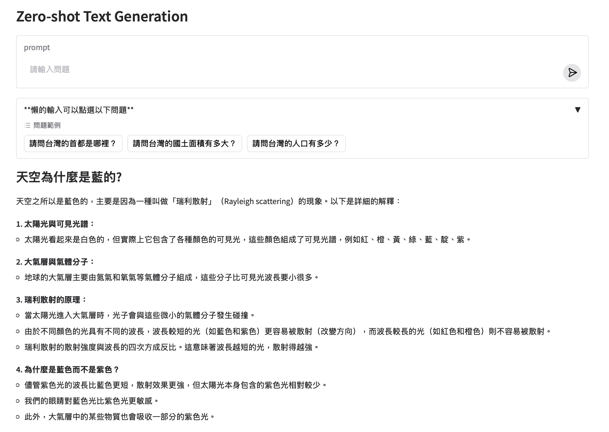
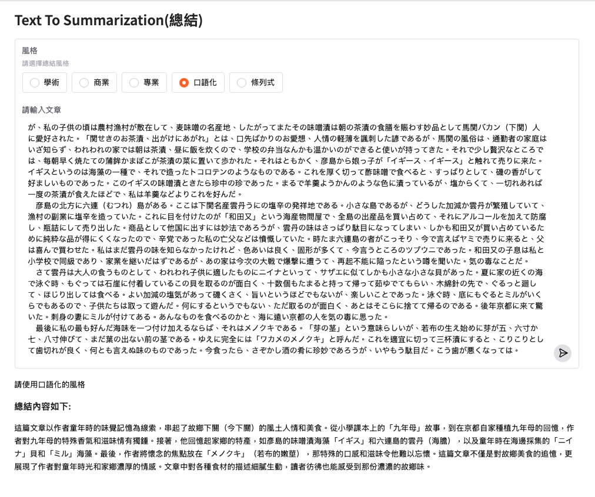
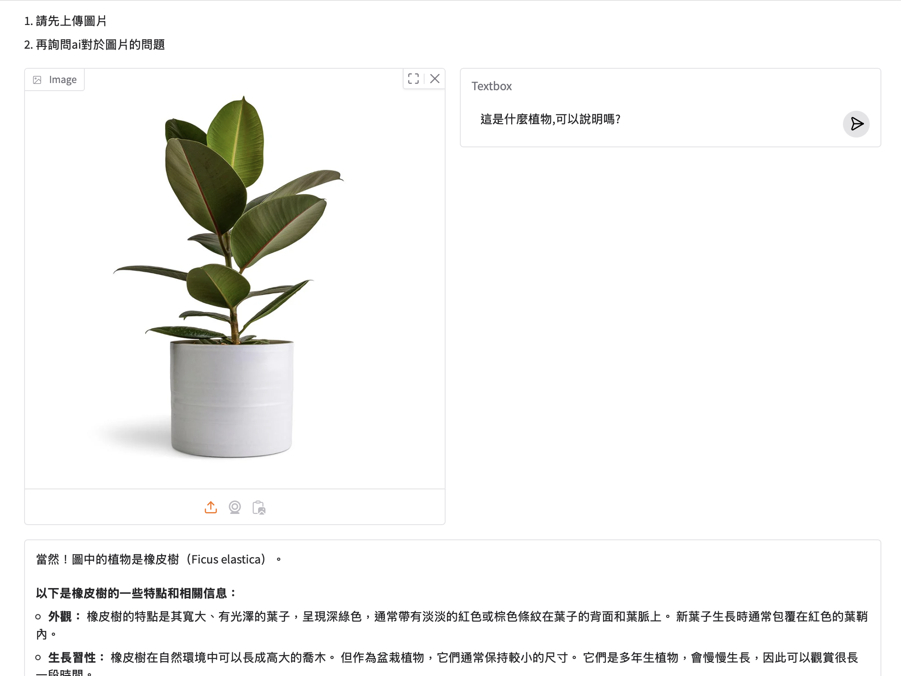
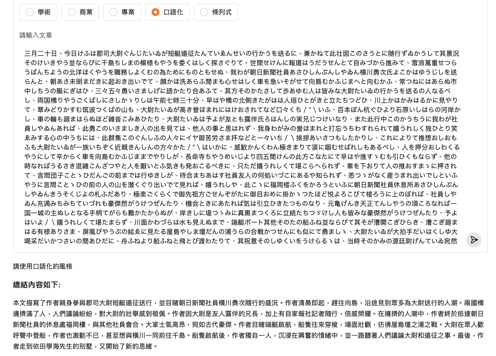
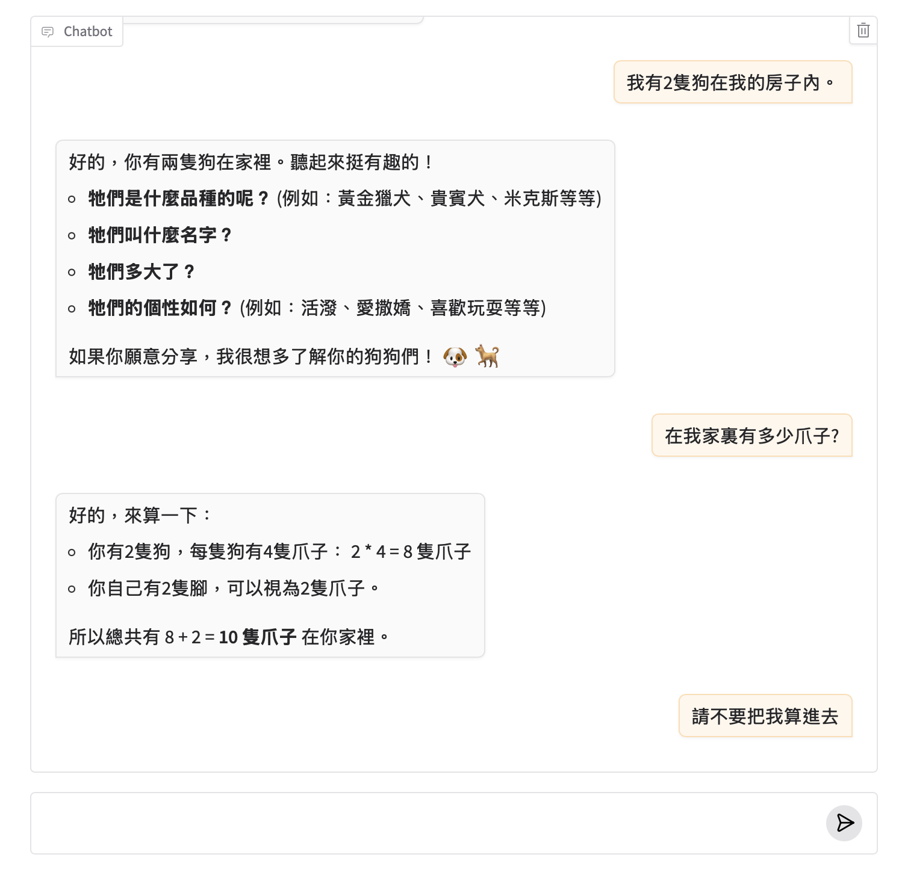

# Gemini 文字生成 (Interactions API 完整指南)

本章節介紹如何使用 Google Gemini 官方最新推薦的 **Interactions API** 進行文字生成、思考控制、系統設定、多模態理解、串流回應、狀態化/無狀態多輪對話與提示詞工程最佳實踐。

> **Interactions API 簡介**：
> Interactions API 是 Gemini 3 系列推薦的統一互動介面。使用 `client.interactions.create()` 即可涵蓋單輪文字生成、多輪狀態化對話（伺服器端透過 `previous_interaction_id` 自動管理對話歷史）、串流傳輸（Streaming）與多模態輸入。
> 官方文件：[Text generation - Google AI for Developers](https://ai.google.dev/gemini-api/docs/text-generation)

---

## 目錄導覽

1. [快速開始：基本文字生成 (Basic Text Generation)](#1-快速開始基本文字生成-basic-text-generation)
2. [思考設定 (Thinking with Gemini)](#2-思考設定-thinking-with-gemini)
3. [系統指示與生成參數 (System Instructions & Generation Config)](#3-系統指示與生成參數-system-instructions--generation-config)
4. [多模態輸入 (Multimodal Inputs)](#4-多模態輸入-multimodal-inputs)
5. [串流回應 (Streaming Responses)](#5-串流回應-streaming-responses)
6. [狀態化多輪對話 (Stateful Multi-turn Conversations)](#6-狀態化多輪對話-stateful-multi-turn-conversations)
7. [無狀態對話 (Stateless Conversations)](#7-無狀態對話-stateless-conversations)
8. [提示詞技巧與最佳實踐 (Prompting Tips & Best Practices)](#8-提示詞技巧與最佳實踐-prompting-tips--best-practices)
9. [專案範例 Notebook](#9-專案範例-notebook)

---

## 1. 快速開始：基本文字生成 (Basic Text Generation)

最基礎的單輪文字輸入與文字生成（Zero-shot Prompting）：

```python
from google import genai
from IPython.display import display, Markdown

client = genai.Client()

interaction = client.interactions.create(
    model="gemini-3.7-flash",
    input="請問你的姓名（請使用繁體中文回答）？"
)

# 使用便利屬性 output_text 取得模型最終輸出文字
display(Markdown(interaction.output_text))

# ==== 輸出範例 ====
# 您好！我是由 Google 訓練的大型語言模型 Gemini。
```

> **便利屬性說明**：
> - `interaction.output_text`（字串）：會自動合併模型回覆中最後連續的文字區塊。
> - `interaction.output_image`：取得最後產生的圖片（用於圖像生成場景）。
> - `interaction.output_audio`：取得最後產生的音訊。

### 整合 Gradio 介面實作

程式檔案：[`zero_shot.py`](./zero_shot.py)

```python
import os
import gradio as gr
from google import genai
from dotenv import load_dotenv

load_dotenv()

client = genai.Client(api_key=os.environ["GEMINI_API_KEY"])

with gr.Blocks(title="Zero-shot Text Generation") as demo:
    gr.Markdown("# Zero-shot Text Generation (Interactions API)")
    
    input_text = gr.Textbox(
        label="Prompt",
        placeholder="請輸入問題...",
        submit_btn=True
    )
    with gr.Accordion("**懶得輸入可以點選以下範例問題**", open=False):
        gr.Examples(
            examples=[
                "請問台灣的首都是哪裡？",
                "請用三句話簡介人工智慧的發展歷史。",
                "請給出五個適合初學者的 Python 學習建議。"
            ],
            label="問題範例",
            inputs=input_text
        )
    output_text = gr.Markdown()

    @input_text.submit(inputs=input_text, outputs=[input_text, output_text])
    def generate_text(input_str: str):
        if not input_str.strip():
            return None, ""
        interaction = client.interactions.create(
            model="gemini-3.7-flash",
            input=input_str
        )
        return None, f"## {input_str}\n\n" + (interaction.output_text or "")

demo.launch()
```



<details>
<summary>🤖 <b>AI 賦能提示詞 (Prompts)：加入 Gradio / Streamlit 介面</b></summary>

**Gradio 介面改寫 Prompt：**
```text
請幫我將上述的 Zero-shot 文字生成範例改寫為美觀的 Gradio 應用：
1. 使用 gr.Blocks 排版，左側放置問題輸入框與常見預設問題按鈕（gr.Examples），右側即時以 Markdown 呈現 Gemini 回答。
2. 整合 client.interactions.create(model="gemini-3.7-flash", input=...)。
3. 加入清除按鈕與送出時的 loading 指示器。
```

**Streamlit 介面改寫 Prompt：**
```text
請幫我將上述的 Zero-shot 文字生成範例改寫為 Streamlit 網頁應用：
1. 使用 st.title 與 st.caption 建立頁面標題與簡介。
2. 提供 st.chat_input 接收使用者輸入，並用 st.session_state 儲存問答結果。
3. 呼叫 Gemini 3.7 Flash API 生成回覆，並以 st.markdown 渲染。
4. 側邊欄提供快捷提問按鈕，點擊後自動填入問題並執行。
```
</details>

---

## 2. 思考設定 (Thinking with Gemini)

Gemini 3 系列模型（如 `gemini-3.7-flash`）具備創新的「**思考與推理（Thinking）**」機制。您可以透過 `generation_config` 中的 `thinking_level` 控制思考深度，以平衡品質、延遲與成本：

| `thinking_level` | 適用情境 | 特性與成本考量 |
| :--- | :--- | :--- |
| `minimal` | 簡易事實查詢、簡短文字翻譯 | 最低延遲、最省 Token |
| `low` | 摘要整理、通用問答 | 具備基礎脈絡檢查，性價比極高 |
| `medium` | 邏輯分析、概念解釋、寫作規劃 | 適中的推理思考深度 |
| `high` | 複雜推理、數學運算、程式碼架構設計 | 最完整深度思考，品質最佳 |

### 思考模式程式碼範例

```python
from google import genai

client = genai.Client()

interaction = client.interactions.create(
    model="gemini-3.7-flash",
    input="請分析量子電腦與傳統電腦在加密演算法破解上的本質差異（請使用繁體中文回答）。",
    generation_config={
        "thinking_level": "medium",
        "temperature": 0.7
    }
)

print(interaction.output_text)
```

<details>
<summary>🤖 <b>AI 賦能提示詞 (Prompts)：加入思考深度控制介面</b></summary>

**Gradio 介面開發 Prompt：**
```text
請幫我將上述思考模式範例改寫為 Gradio 應用：
1. 設計包含問題輸入框、thinking_level 單選按鈕（minimal, low, medium, high）的控制面板。
2. 整合 Gemini Interactions API，將使用者選取的思考深度動態傳入 generation_config。
3. 回覆區以 Markdown 呈現，並顯示當前所使用的思考深度與執行狀態。
```

**Streamlit 介面開發 Prompt：**
```text
請幫我將上述思考模式範例改寫為 Streamlit 應用：
1. 側邊欄提供 st.select_slider 選擇思考深度（minimal, low, medium, high），並附上各等級說明。
2. 主畫面提供 st.text_area 與 st.button。
3. 按下生成時呼叫 Gemini 3.7 Flash 並顯示思考中狀態動畫（st.spinner），回覆完成後以 st.markdown 展示。
```
</details>

---

## 3. 系統指示與生成參數 (System Instructions & Generation Config)

您可以透過 `system_instruction` 與 `generation_config` 精準規範模型的角色設定、行事規範以及輸出隨機性。

### 核心生成參數一覽表

| 參數名稱 | 說明與取值範圍 | 典型應用建議 |
| :--- | :--- | :--- |
| `temperature` | 取值 `0.0` ~ `2.0`。控制輸出隨機性：值越低越確定、值越高越具創意。 | 程式碼/資料擷取建議 `0.0~0.3`；日常寫作建議 `0.7`；腦力激盪建議 `1.0+` |
| `top_p` | 取值 `0.0` ~ `1.0`（核取樣）。根據累積機率篩選候選詞彙。 | 通常使用預設值或搭配 `temperature` 微調 |
| `top_k` | 取值整數。限制每一步僅從機率最高的前 K 個詞中選取。 | 限制輸出範圍，提升嚴謹度 |
| `max_output_tokens` | 限制模型最多產生的 Token 數量。 | 防止回覆過長，精準控制費用與長度 |
| `stop_sequences` | 傳入字串列表（如 `["\n---", "END"]`），模型遇到該字串即停止。 | 自動化對話終止、自訂分段 |

### 文章總結與風格控制實戰 (整合 Gradio)

程式檔案：[`text_to_summarization.py`](./text_to_summarization.py)

```python
import os
import gradio as gr
from google import genai
from dotenv import load_dotenv

load_dotenv()

client = genai.Client(api_key=os.environ["GEMINI_API_KEY"])

with gr.Blocks(title="Text Summarization & Style Control") as demo:
    gr.Markdown("# Text To Summarization (文章總結與風格控制)")
    
    with gr.Row():
        style_radio = gr.Radio(
            ['學術', '商業', '專業', '口語化', '條列式'],
            label='風格設定',
            info="請選擇文章總結的語氣與風格",
            value='口語化'
        )
        temp_slider = gr.Slider(
            minimum=0.0,
            maximum=2.0,
            value=0.7,
            step=0.1,
            label="Temperature (創意度)",
            info="較低值更穩定精確，較高值更具創意"
        )

    input_text = gr.Textbox(
        label="請輸入文章內容",
        placeholder="貼上或輸入欲總結的長篇文章...",
        lines=8,
        submit_btn=True
    )
    output_md = gr.Markdown()

    @input_text.submit(inputs=[style_radio, temp_slider, input_text], outputs=[output_md])
    def generate_text(style: str, temperature: float, input_str: str):
        if not input_str.strip():
            gr.Warning("請輸入文章內容！")
            return ""

        style_prompts = {
            "口語化": "請使用輕鬆自然、通俗易懂的口語化風格。",
            "學術": "請使用嚴謹、精準且具學術分析感的語調。",
            "商業": "請使用精簡幹練、聚焦商業價值與行動建議的風格。",
            "專業": "請使用清晰、客觀且條理分明的專業語氣。",
            "條列式": "請將核心重點以結構化條列方式列出。"
        }
        style_guide = style_prompts.get(style, f"請使用{style}風格。")

        interaction = client.interactions.create(
            model="gemini-3.7-flash",
            system_instruction=f"""
            你是一位專業的文章總結專家，也是繁體中文的語言高手。
            請遵守以下規則：
            1. 將輸入的內容進行重點總結。
            2. 風格要求：{style_guide}
            3. 一律使用繁體中文輸出。
            """,
            input=input_str,
            generation_config={
                "temperature": temperature,
                "max_output_tokens": 1024
            }
        )

        return f"**【風格：{style}｜Temperature：{temperature}】**\n\n### 總結內容：\n" + (interaction.output_text or "")

demo.launch()
```



<details>
<summary>🤖 <b>AI 賦能提示詞 (Prompts)：加入文章總結與風格轉換介面</b></summary>

**Gradio 介面開發 Prompt：**
```text
請幫我將上述的文章總結與風格控制程式改寫為功能更完整的 Gradio 應用：
1. 介面提供長文本輸入框（Multiline Textbox）、目標風格單選框（學術/商業/專業/口語化/條列式），並新增「目標語言（繁中/英文/日文）」下拉選單。
2. 透過 Gemini Interactions API 的 system_instruction 設定角色與風格規則。
3. 輸出區包含總結結果、字數統計及一鍵複製按鈕。
```

**Streamlit 介面開發 Prompt：**
```text
請幫我將上述文章總結程式改寫為 Streamlit 應用：
1. 使用兩欄版面（st.columns）：左欄為原文輸入區（可貼上文字或上傳 txt 檔）與風格設定（st.segmented_control 或 st.radio），右欄為即時總結產出區。
2. 使用 st.button("開始摘要") 觸發，並以 st.spinner 顯示處理進度。
3. 生成後提供下載摘要文字檔按鈕（st.download_button）。
```
</details>

---

## 4. 多模態輸入 (Multimodal Inputs)

Gemini 原生支援多模態輸入，您可以將文字與一張或多張圖片同時傳送給模型進行比對、分析或問答。

### 多模態輸入格式（以 Base64 為例）

```python
import PIL.Image
import io, base64
from google import genai
from IPython.display import display, Markdown

client = genai.Client()

# 讀取圖片並轉為 Base64 字串
image = PIL.Image.open('bear.jpg')
buffered = io.BytesIO()
image.save(buffered, format="JPEG")
img_b64 = base64.b64encode(buffered.getvalue()).decode("utf-8")

# 傳送圖文混合 input
interaction = client.interactions.create(
    model="gemini-3.7-flash",
    input=[
        {"type": "text", "text": "請告訴我這是什麼動物，以及它的棲息地與生態習性（請使用繁體中文回答）："},
        {"type": "image", "data": img_b64, "mime_type": "image/jpeg"}
    ]
)

display(Markdown(interaction.output_text))
```

> **支援多圖輸入**：若要比較兩張圖片，只需在 `input` 陣列中放入多個 `{"type": "image", ...}` 物件即可。

### 多模態圖文問答整合 Gradio

程式檔案：[`image_text.py`](./image_text.py)

```python
import os
import io
import base64
import gradio as gr
from google import genai
from dotenv import load_dotenv

load_dotenv()

client = genai.Client(api_key=os.environ['GEMINI_API_KEY'])

with gr.Blocks(title="Multimodal Image & Text Analysis") as demo:
    gr.Markdown("# Multimodal Image & Text (多模態圖文問答)")
    gr.Markdown("1. 請先上傳圖片\n2. 輸入針對該圖片的提問或任務需求")
    
    with gr.Row():
        image_input = gr.Image(type="pil", label="上傳圖片")
        with gr.Column():
            text_box = gr.Textbox(
                label="提問內容",
                placeholder="例如：請詳細描述圖片中的內容，或辨識圖中的重點文字...",
                lines=4,
                submit_btn=True
            )
            quick_btns = gr.Examples(
                examples=[
                    "請詳細描述這張圖片的內容與場景。",
                    "請辨識並列出圖片中的所有主要物件。",
                    "這張圖片給人什麼樣的氛圍或感受？"
                ],
                inputs=text_box,
                label="快捷提問範例"
            )

    answer = gr.Markdown(min_height=120, label="分析結果")

    @text_box.submit(inputs=[image_input, text_box], outputs=[answer])
    def analyze_image_and_text(image, prompt, progress=gr.Progress()):
        if image is None:
            gr.Warning("請先上傳圖片！")
            return ""

        if not prompt.strip():
            gr.Warning("請輸入提問內容！")
            return ""

        progress(0.3, desc="處理圖片中...")
        buffered = io.BytesIO()
        image.save(buffered, format="JPEG")
        img_b64 = base64.b64encode(buffered.getvalue()).decode("utf-8")

        progress(0.7, desc="Gemini 分析中...")
        interaction = client.interactions.create(
            model="gemini-3.7-flash",
            input=[
                {"type": "text", "text": prompt + "\n（請使用繁體中文回答）"},
                {"type": "image", "data": img_b64, "mime_type": "image/jpeg"}
            ]
        )
        progress(1.0, desc="完成！")
        return interaction.output_text or ""

demo.launch()
```



<details>
<summary>🤖 <b>AI 賦能提示詞 (Prompts)：加入多模態圖文辨識介面</b></summary>

**Gradio 介面開發 Prompt：**
```text
請幫我將上述多模態圖文辨識程式改寫為 Gradio 應用：
1. 介面分為左右兩欄，左側提供圖片上傳元件（gr.Image）與預設提問選項（如「辨識圖中物體」、「翻譯圖中文字」、「描述場景」），右側為問題輸入框與 Markdown 分析結果展示。
2. 整合 Gemini Interactions API 傳入 Base64 圖片與提示詞。
3. 上傳新圖片時自動清空舊的回覆並提示使用者提問。
```

**Streamlit 介面開發 Prompt：**
```text
請幫我將上述多模態圖文辨識程式改寫為 Streamlit 應用：
1. 使用 st.file_uploader 支援使用者上傳 JPG/PNG 圖片，並使用 st.image 即時預覽上傳圖片。
2. 提供 st.text_input 讓使用者輸入針對該圖片的提問（預設為「請詳細分析這張圖片的內容」）。
3. 將圖片轉為 Base64 後呼叫 Gemini 3.7 Flash Interactions API，並使用 st.chat_message 或 st.markdown 呈現圖文辨識結果。
```
</details>

---

## 5. 串流回應 (Streaming Responses)

設定 `stream=True` 可開啟伺服器推送串流，並在迴圈中處理 `step.delta` 事件（當 `delta.type == "text"` 時即時取得輸出）：

```python
from google import genai

client = genai.Client()
stream = client.interactions.create(
    model="gemini-3.7-flash",
    input="請用繁體中文以條列式說明機器學習的三大類別（監督式、非監督式、強化學習）。",
    stream=True
)

for event in stream:
    if event.event_type == "step.delta" and event.delta.type == "text":
        print(event.delta.text, end="", flush=True)
```

### 串流總結整合 Gradio (Generator / Yield)

程式檔案：[`text_streaming.py`](./text_streaming.py)

```python
import os
import gradio as gr
from google import genai
from dotenv import load_dotenv

load_dotenv()

client = genai.Client(api_key=os.environ["GEMINI_API_KEY"])

with gr.Blocks(title="Streaming Text Summarization") as demo:
    gr.Markdown("# Text Streaming Summarization (即時串流總結)")
    
    style_radio = gr.Radio(
        ['口語化', '條列式', '學術', '商業', '專業'],
        label='風格選擇',
        info="請選擇欲生成的風格",
        value='口語化'
    )
    input_text = gr.Textbox(
        label="請輸入文章內容",
        placeholder="貼上或輸入欲總結的長篇文章...",
        lines=8,
        submit_btn=True
    )
    output_md = gr.Markdown(label="即時產出")

    @input_text.submit(inputs=[style_radio, input_text], outputs=[output_md])
    def generate_streaming_text(style: str, input_str: str):
        if not input_str.strip():
            gr.Warning("請輸入內容！")
            return

        stream = client.interactions.create(
            model="gemini-3.7-flash",
            system_instruction=f"""
            你是一位文章總結專家，請將使用者輸入的內容進行【{style}】風格的重點總結，並一律使用繁體中文。
            """,
            input=input_str,
            stream=True
        )

        result_text = ""
        header = f"**【風格：{style}（串流生成中...）】**\n\n### 總結內容：\n"
        for event in stream:
            if event.event_type == "step.delta" and event.delta.type == "text":
                result_text += event.delta.text
                yield header + result_text

demo.launch()
```



<details>
<summary>🤖 <b>AI 賦能提示詞 (Prompts)：加入打字機串流效果介面</b></summary>

**Gradio 介面開發 Prompt：**
```text
請幫我將上述程式改寫為具有即時串流（Streaming / 打字機效果）的 Gradio 應用：
1. 建立文字輸入框與風格選單，按下送出後呼叫 stream=True 的 client.interactions.create。
2. 使用 Python generator 的 `yield` 語法，逐字更新輸出區的 Markdown 內容，實現流暢的打字機效果。
```

**Streamlit 介面開發 Prompt：**
```text
請幫我將上述程式改寫為支援打字機串流輸出的 Streamlit 應用：
1. 使用 `st.write_stream` 或逐字迭代器（Generator）接收 Gemini API 串流事件。
2. 當 event.delta.type == "text" 時 yield 文字內容，讓 Streamlit 前端以原生打字機動畫流暢輸出。
3. 介面提供文章輸入與風格切換控制項。
```
</details>

---

## 6. 狀態化多輪對話 (Stateful Multi-turn Conversations)

Interactions API 提供強大的**伺服器端狀態管理**功能。呼叫時只需傳入上一輪的 `previous_interaction_id=interaction1.id`，伺服器便會自動串接完整上下文，無需客戶端每一次手動重送歷史記錄。

### 多輪對話基礎範例

```python
from google import genai
from IPython.display import display, Markdown

client = genai.Client()

# 第 1 輪提問
interaction1 = client.interactions.create(
    model="gemini-3.7-flash",
    input="我家裡養了 2 隻狗和 3 隻貓。"
)
print("第 1 輪：", interaction1.output_text)

# 第 2 輪提問（帶入上一輪的 ID，伺服器自動延續記憶）
interaction2 = client.interactions.create(
    model="gemini-3.7-flash",
    input="那我總共有幾隻寵物？它們加起來總共有幾隻爪子？",
    previous_interaction_id=interaction1.id
)
print("第 2 輪：", interaction2.output_text)
```

### 多輪對話 + 串流聊天室整合 Gradio

程式檔案：[`chat.py`](./chat.py)

```python
import os
import gradio as gr
from google import genai
from dotenv import load_dotenv

load_dotenv()

client = genai.Client(api_key=os.environ['GEMINI_API_KEY'])

# 全域記錄前一次互動 ID（伺服器端狀態管理）
last_interaction_id = None

def chat_response(message, history):
    global last_interaction_id
    
    stream = client.interactions.create(
        model="gemini-3.7-flash",
        input=message,
        previous_interaction_id=last_interaction_id,
        stream=True
    )
    
    accumulated_text = ""
    for event in stream:
        if hasattr(event, "interaction_id") and event.interaction_id:
            last_interaction_id = event.interaction_id
        elif hasattr(event, "id") and event.id:
            last_interaction_id = event.id
            
        if event.event_type == "step.delta" and event.delta.type == "text":
            accumulated_text += event.delta.text
            yield accumulated_text

demo = gr.ChatInterface(
    fn=chat_response,
    title="Gemini Multi-turn Chat (Interactions API)",
    description="利用 Google Interactions API 的伺服器端狀態管理（`previous_interaction_id`）維護歷史上下文，並支援即時串流。",
    type="messages"
)

demo.launch()
```



<details>
<summary>🤖 <b>AI 賦能提示詞 (Prompts)：加入多輪對話聊天機器人介面</b></summary>

**Gradio 介面開發 Prompt：**
```text
請幫我將上述多輪對話程式改寫為 Gradio Chat 應用程式：
1. 使用 `gr.ChatInterface` 或 `gr.Chatbot` 建立 ChatGPT 風格的聊天室介面。
2. 整合 Gemini Interactions API 的伺服器端狀態維護功能（利用 `previous_interaction_id` 紀錄前一輪 ID）。
3. 支援串流打字機回覆效果（在 fn 中使用 yield）。
4. 包含「重設對話 / 清空歷史」按鈕，重設時將 last_interaction_id 清空為 None。
```

**Streamlit 介面開發 Prompt：**
```text
請幫我將上述多輪對話程式改寫為 Streamlit 聊天機器人（Chatbot）：
1. 使用 `st.chat_message` 與 `st.chat_input` 構建現代化聊天介面。
2. 使用 `st.session_state` 儲存對話訊息列表與 `last_interaction_id`。
3. 呼叫 Gemini 3.7 Flash API 時帶入 `previous_interaction_id`，並支援 `stream=True` 即時輸出。
4. 側邊欄提供「清空對話」按鈕，點擊後重設對話紀錄與 ID。
```
</details>

---

## 7. 無狀態對話 (Stateless Conversations)

若您的應用程式注重隱私、歷史由本地資料庫維護，或希望完全由客戶端控制每一次請求的完整上下文：
1. 在請求中設定 `store=False`。
2. 由客戶端維護 `history`（`steps`）列表。
3. 後續請求將累計的步驟作為 `input` 傳入。

```python
from google import genai

client = genai.Client()

history = [
    {
        "type": "user_input",
        "content": [{"type": "text", "text": "我有 2 隻狗在我的房子內"}]
    }
]

# 第 1 輪 (store=False 表示伺服器不儲存狀態)
interaction1 = client.interactions.create(
    model="gemini-3.7-flash",
    store=False,
    input=history
)
print("第 1 輪：", interaction1.output_text)

# 將模型產生的 steps 記錄進本地歷史
for step in interaction1.steps:
    history.append(step.model_dump())

# 加入使用者第 2 輪問題
history.append({
    "type": "user_input",
    "content": [{"type": "text", "text": "在我家裡有多少爪子？"}]
})

# 第 2 輪請求 (將完整 history 傳入)
interaction2 = client.interactions.create(
    model="gemini-3.7-flash",
    store=False,
    input=history
)
print("第 2 輪：", interaction2.output_text)
```

---

## 8. 提示詞技巧與最佳實踐 (Prompting Tips & Best Practices)

若要獲得最高品質的模型輸出，建議遵循以下 Prompt Engineering 準則：

1. **明確的角色與任務定義**：
   - 善用 `system_instruction` 為模型賦予專業身分、目標受眾與語氣風格。
2. **提供 Few-shot 範例**：
   - 在提示詞中給出 1~3 個「輸入與期望輸出」的範例，能大幅提高模型輸出的格式一致性。
3. **結構化思考引導**：
   - 指示模型「請一步一步思考」、「先列出關鍵事實，再進行推論與總結」。
4. **指定輸出格式與邊界條件**：
   - 明確說明「請使用繁體中文」、「以 Markdown 表格呈現」、「如果找不到答案請直接回答不知道」。

---

## 9. 專案範例 Notebook

* [`text_generation_quickstart.ipynb`](./text_generation_quickstart.ipynb)：Interactions API 完整語法互動體驗
* [`trip_planner_system_instruction.ipynb`](./trip_planner_system_instruction.ipynb)：旅遊行程規劃與長文本結構化實戰範例
