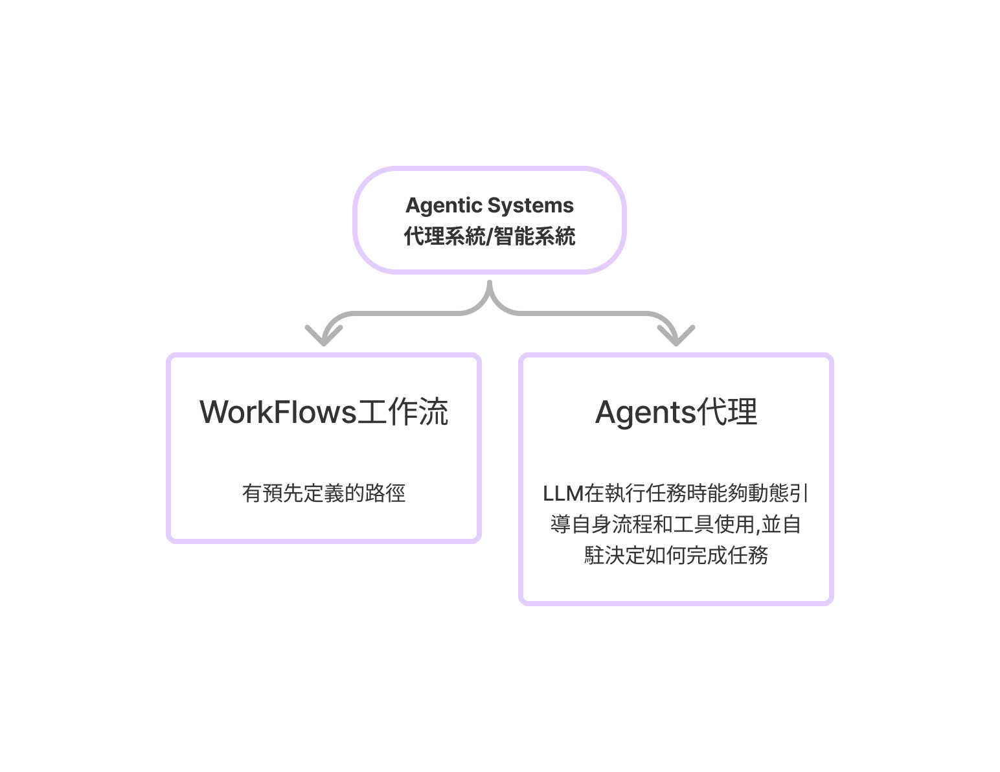
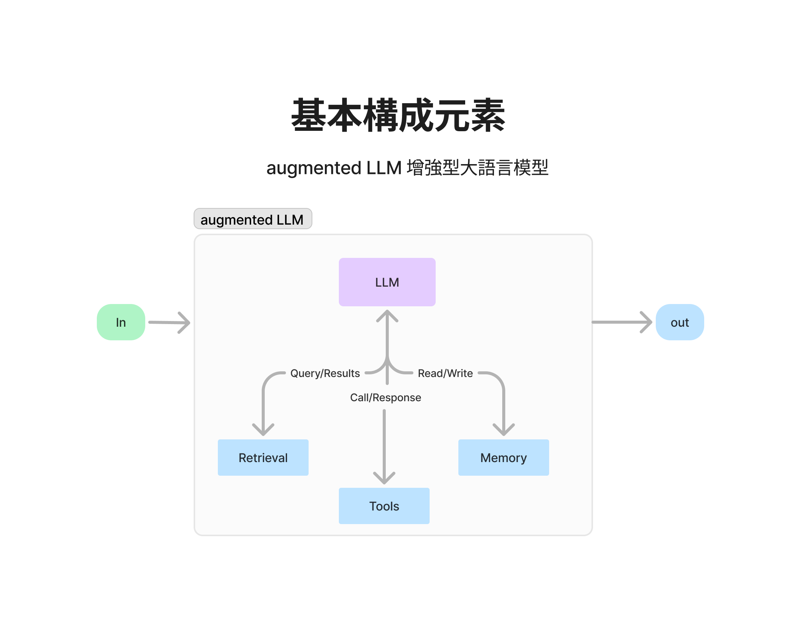

# 何謂AI代理

- 自動完整整套工作流程

## workflows工作流類別

1. Prompt chaining 串聯
2. Parallelization 並聯
3. Routing 選擇路徑
4. Orchestrator-workers 協調者-工作者
5. Evaluator-optimizer 評估者-優化者

## 基本構成元素
- 輸入
- augmented LLM(增強型大語言模型)
- 輸出

