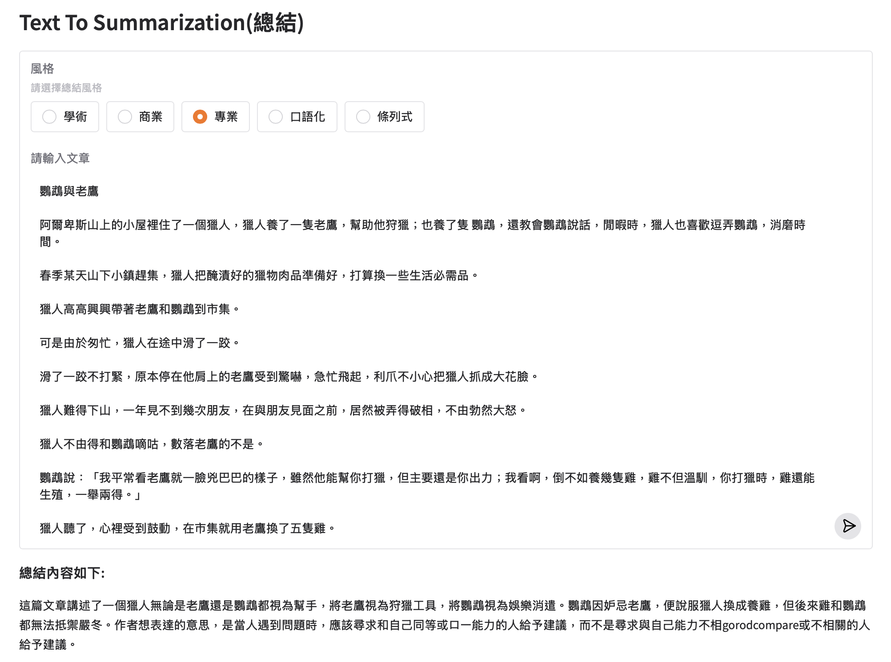

## 開源模型

### 使用模型(serverless)
- mistralai/Mistral-Nemo-Instruct-2407
- huggingface網址 - https://huggingface.co/mistralai/Mistral-Nemo-Instruct-2407
- 點選Deploy按鈕才找的到serverless連結方式

**text-to-summarization(gradio)**

```python
import os
import gradio as gr
from huggingface_hub import InferenceClient

client = InferenceClient(
	api_key="========huggingface token========"
)

with gr.Blocks(title="Example") as demo:
    gr.Markdown("# Text To Summarization(總結)")
    style_radio = gr.Radio(['學術','商業','專業','口語化','條列式'],label='風格',info="請選擇總結風格",value='口語化') 
    input_text = gr.Textbox(
        label="請輸入文章",
        lines=10,
        submit_btn=True
        )
    output_md = gr.Markdown()

    @input_text.submit(inputs=[style_radio,input_text], outputs=[output_md])
    def generate_text(style:str,input_str:str):     
        
        if style=="口語化":
            style = "請使用口語化的風格\n"
        elif style == "學術":
            style = "請使用專業學術的風格\n"
        elif style == "商業":
            style = "請使用商業文章的風格\n"
        elif style == "條列式":
            style = "請條列式重點\n"

        style = "請摘要這些文章\n請使用繁體中文回答\n" + style
        
        messages = [
            {
                "role":"system",
                "content":style
            },
            {
                "role": "user",
                "content": input_str
            }
        ]

        completion = client.chat.completions.create(
            model="mistralai/Mistral-Nemo-Instruct-2407", 
            messages=messages, 
            max_tokens=1000
        )

        return  f"### 總結內容如下:\n" + completion.choices[0].message.content

demo.launch()
```



